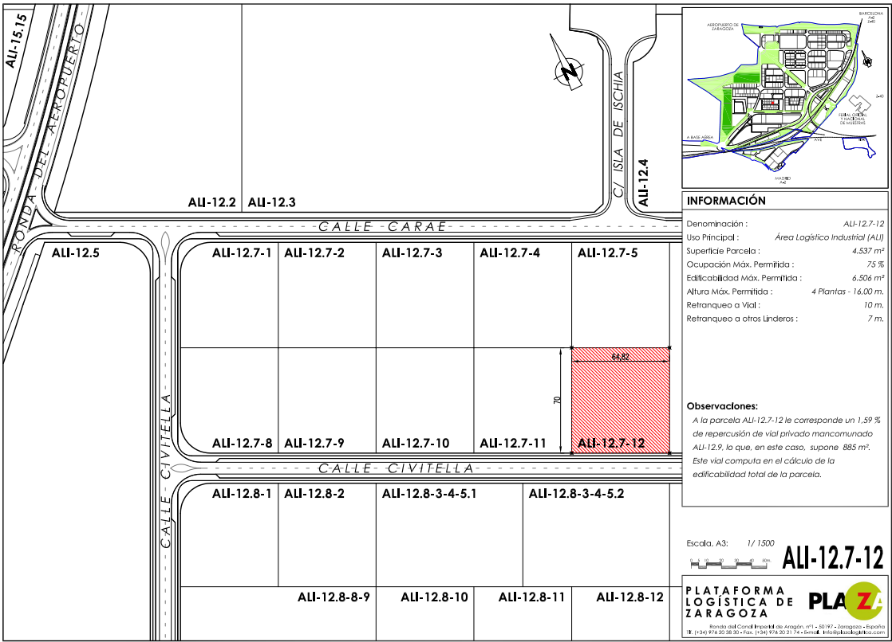
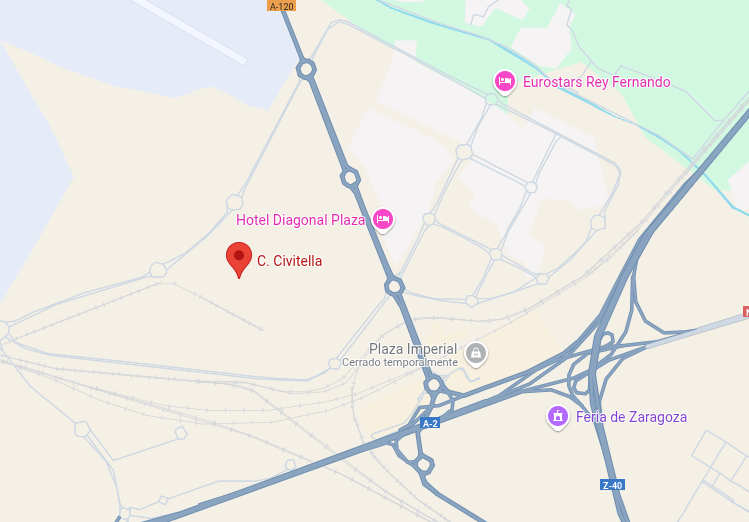
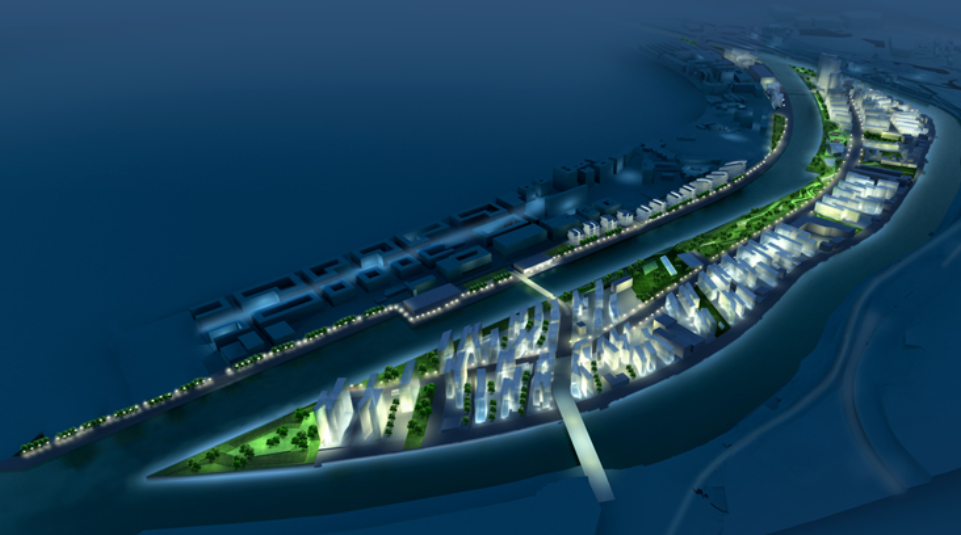
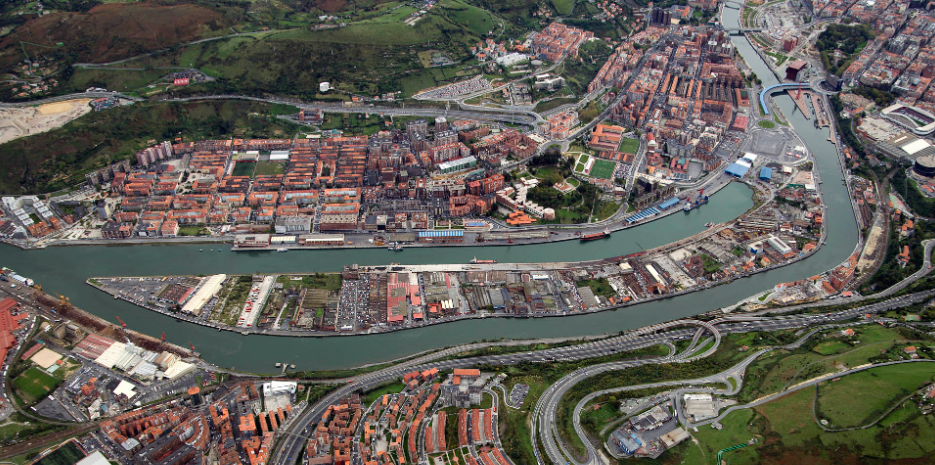
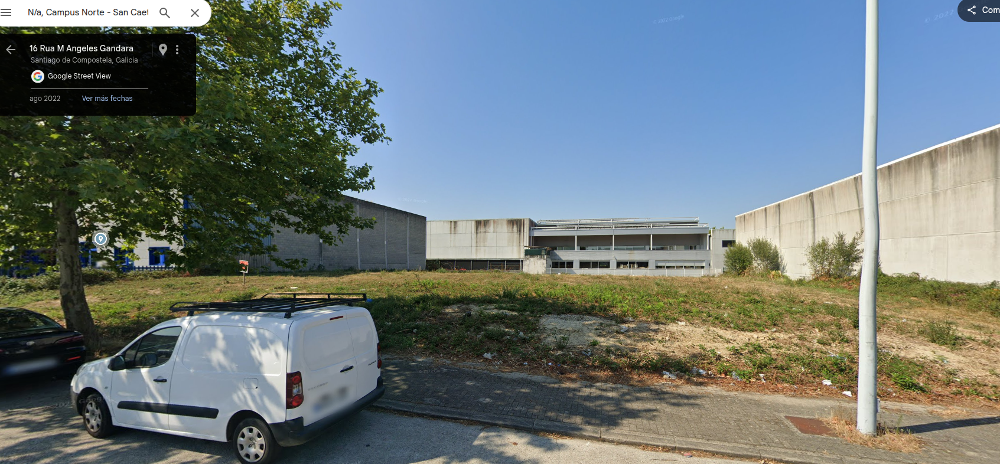
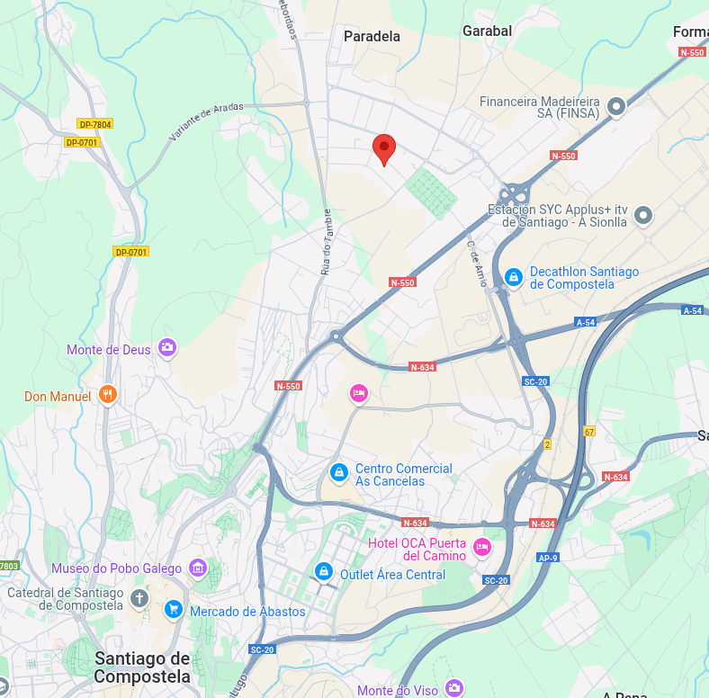
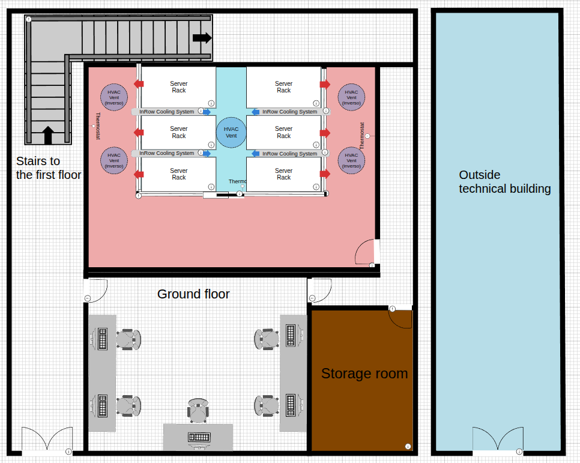
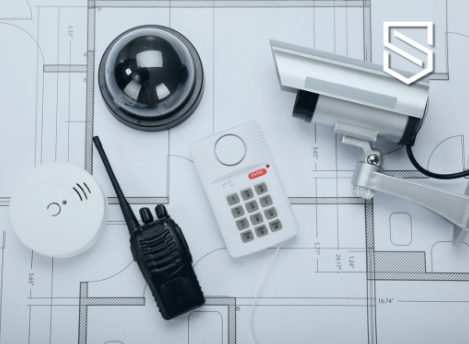
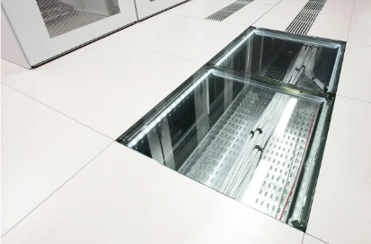

# 📘 **THE CURE PROJECT** 🧑‍💻🚀

# Introducción y Objetivos del Proyecto de Innovate Tech

## Introducción

En un entorno donde la digitalización impulsa el éxito empresarial, los Centros de Procesamiento de Datos (CPD) son el corazón operativo de compañías como InnovateTech, una empresa tecnológica española líder en distribución de contenido multimedia (audio y vídeo bajo demanda, AOD y VOD).  
Actualmente, los servicios de InnovateTech se ofrecen exclusivamente a través de su plataforma web, ya que las aplicaciones móviles están en fase de desarrollo y aún no están operativas. La empresa opera únicamente en el mercado europeo, donde se ha consolidado con más de 3 millones de usuarios registrados.  
Como parte de su compromiso con la innovación tecnológica y la sostenibilidad, se dirigieron a nosotros con el objetivo de diseñar e implantar una arquitectura de Centro de Procesamiento de Datos (CPD) en la nube, adaptado a nuestras necesidades actuales y futuras. Buscaban una solución integral que integrará el servicio web de la empresa y la transmisión de audio y vídeo, que fuera eficaz en términos de rendimiento, seguridad y eficiencia energética.

## Definición de la Empresa

InnovateTech es una empresa tecnológica con diferentes sedes en España, dedicada a la distribución de contenido multimedia en formatos de audio y vídeo bajo demanda (AOD y VOD). Su modelo de negocio se posiciona como un punto intermedio entre plataformas líderes como Spotify y Netflix, enfocándose en la distribución de contenidos de alta calidad bajo demanda.  
Durante momentos de alta demanda, como estrenos, eventos en directo o lanzamientos especiales, InnovateTech alcanza picos de entre 500.000 y 1.000.000 usuarios concurrentes, lo que la establece como uno de los principales actores regionales en el sector multimedia. Aunque no compite al nivel de los gigantes globales, su alcance y rendimiento a escala continental son significativos, ofreciendo servicios exclusivamente a usuarios geolocalizados en Europa.  
InnovateTech se compromete con el desarrollo responsable y sostenible, tal como se refleja en su apuesta por soluciones que cumplan con los Objetivos de Desarrollo Sostenible (ODS) de la Agenda 2030. Concretamente, quieren contribuir activamente a los ODS 7 (Energía asequible y no contaminante), ODS 9 (Industria, innovación e infraestructura), ODS 12 (Producción y consumo responsables), ODS 13 (Acción por el clima) y ODS 16 (Paz, justicia e instituciones sólidas).

## Objetivos del proyecto

Diseñar una infraestructura tecnológica de CPD que garantice eficiencia operativa, seguridad de datos y sostenibilidad ambiental, alineada con los requerimientos del negocio.  
El proyecto se estructura en torno a metas claras que aseguran el cumplimiento de las necesidades operativas y estratégicas de InnovateTech:

- Diseñar una arquitectura híbrida robusta que integre CPDs físicos Tier 2 en España con servicios AWS, garantizando alta disponibilidad y escalabilidad para soportar picos de hasta 1 millón de usuarios concurrentes en streaming de audio y video bajo demanda. Asimismo, esta infraestructura alojará servicios críticos locales (bases de datos y monitorización).
- Garantizar la protección de los datos de más de 3 millones de usuarios mediante el cumplimiento de normativas internacionales implementando almacenamiento local, replicación segura y medidas de seguridad física avanzadas, como controles biométricos y videovigilancia.
- Optimizar el uso de recursos energéticos mediante tecnologías como free cooling, geotermia inversa y energía renovable (70-80%), calculando la huella ecológica con herramientas como el AWS Carbon Footprint Calculator para minimizar el impacto ambiental.

---

# PROPUESTA DE CPD SOSTENIBLE PARA INNOVATETECH

---
## Ubicación Física

La selección de las ubicaciones específicas para los CPD se basa en un análisis exhaustivo de factores como conectividad, accesibilidad, seguridad y huella ecológica. También hemos tenido en cuenta la actividad sísmica de cada una de las sedes propuestas a continuación.

Asimismo, proponemos tres ubicaciones estratégicas en España —Zaragoza, Bilbao y Santiago de Compostela—, cada una diseñada para cumplir roles específicos en la infraestructura híbrida de Innovate Tech. 

**Zaragoza**

En el nordeste de España, ha sido seleccionada como la ubicación del CPD principal debido a su posición como hub tecnológico emergente, respaldado por inversiones significativas de Amazon Web Services (AWS) previstas hasta 2030. 
La ciudad cuenta con una conectividad de fibra óptica de alta capacidad conectada al nodo ESpanix, lo que permite latencias inferiores a 10 ms hacia regiones cloud de AWS, como eu-west-3 en París, haciéndola ideal para soportar streaming multimedia en tiempo real. 
El suelo industrial en la zona logística de PLAZA es económico, lo que facilita la construcción de la nave industrial adaptada. Además, el 70% de la energía consumida en Zaragoza proviene de fuentes renovables, principalmente eólica y solar, complementada con paneles solares Sika SolarRoof de 20 kW y almacenamiento en baterías externas.

**Ubicación propuesta de CPD en Zaragoza**:

41.639983, -1.005463

C. Civitella, 12, 50197 Zaragoza

El clima semiárido de la región, con una temperatura media de 15°C, permite implementar free cooling durante 8-9 meses al año, logrando un Power Usage Effectiveness (PUE) de aproximadamente 1.3. La proximidad a la Universidad de Zaragoza y los clusters TIC locales garantiza acceso a talento técnico especializado.

---

**Bilbao**

Situada en el norte de España, será la sede del CPD secundario, diseñada para proporcionar redundancia, respaldo activo, balanceo de carga y recuperación ante desastres. La ciudad ofrece una conectividad robusta a través del punto de intercambio Bilbao IX y cables submarinos como Marea, serán clave en la escalabilidad de este proyecto.

Su clima oceánico, con una temperatura media de 13°C, es óptimo para free cooling durante todo el año, alcanzando un PUE de 1.2, uno de los más bajos de las ubicaciones propuestas.

Aproximadamente el 60% de la energía consumida en Bilbao es renovable, procedente de fuentes eólica e hidráulica, y se complementa con paneles solares de 15 kW instalados en la nave industrial, junto con sistemas de recuperación de calor residual que promueven la economía circular.

La zona industrial moderna de Zorrotzaurre, combinada con la presencia de la Universidad del País Vasco (UPV/EHU), facilita la gestión operativa y el acceso a personal cualificado.

**Ubicación propuesta de CPD en Bilbao**:

Zorrotzaurre

48014 Bilbao, Vizcaya

---

**Santiago de Compostela**

En el noroeste, funcionará como el CPD de respaldo pasivo, dedicado a copias de seguridad remotas, recuperación ante desastres y almacenamiento en frío. La región destaca por su liderazgo en energía renovable, con un 80% de su suministro proveniente de fuentes hidráulicas, lo que minimiza la huella de carbono de las operaciones. 
La nave industrial incluirá paneles solares de 10 kW para complementar el suministro energético. El clima templado de Santiago, con una temperatura media de 14°C, permite free cooling durante 10 meses al año, logrando un PUE de 1.25. 
Aunque el suelo industrial en esta región es más costoso, la estabilidad climática y la disponibilidad de talento técnico a través de la Universidad de Santiago compensan esta inversión. La red de fibra óptica de la ciudad es adecuada para soportar tráfico multimedia, haciendo de Santiago una ubicación estratégica para almacenamiento en frío y recuperación.

admin

**Ubicación propuesta de CPD en Santiago de Compostela**:

Rua M Angeles Gandara, 21, 15898 Santiago de Compostela, La Coruña

---

### Situación física de la sala

En cuanto a la ubicación física cada CPD estará ubicado dentro de una nave industrial diseñada y adaptada exclusivamente para alojar la infraestructura tecnológica crítica de InnovateTech. La nave tendrá un tamaño acorde a la cantidad de racks y equipos necesarios, con espacios técnicos auxiliares independientes.

La sala principal del CPD que contiene los racks de servidores, el cableado estructurado, los sistemas de refrigeración y las herramientas de monitorización estará situada en la planta baja, centralizada y alejada de las fachadas exteriores, con el propósito de minimizar el impacto térmico provocado por la radiación solar directa y facilitar un ambiente térmico estable y controlado. 

En el espacio restante de la planta baja se encontrarán las zonas habilitadas para el personal presencial, además de oficinas y almacenes. La sala no será identificable desde el exterior ni fácilmente accesible, garantizando la seguridad física mediante un control estricto y monitorizado de los accesos.

La distribución interior permitirá una gestión eficiente del cableado, energía y climatización, con un suelo técnico elevado para el paso ordenado del cableado y la gestión del flujo de aire. Esta disposición garantiza un acceso rápido y seguro a los equipos críticos, facilitando tareas operativas y de resolución de incidencias. 

En cuanto al edificio auxiliar exterior, por su parte, concentra las infraestructuras de apoyo, como los generadores, baterías y SAI, asegurando que las actividades de mantenimiento no afecten el funcionamiento de la sala de servidores. 

**Edificio Auxiliar**

Los sistemas de energía auxiliar y las instalaciones auxiliares se alojan en un edificio técnico exterior, separado físicamente de la sala de servidores, lo que permite realizar tareas de mantenimiento sin interferir en el entorno crítico de cada CPD. Este edificio auxiliar alberga los generadores eléctricos de emergencia, los bancos de baterías y los sistemas de alimentación ininterrumpida (SAI), garantizando una continuidad operativa robusta y un acceso seguro para el personal técnico.
Los generadores, que operan con diésel o gas natural, ofrecen una autonomía mínima de 48 horas, mientras que los SAI online de doble conversión, con una eficiencia del 95%, proporcionan una autonomía de 15 a 30 minutos, dependiendo de la ubicación del CPD. Los bancos de baterías, basados en tecnología de litio o AGM sellada, están alojados en armarios ventilados para cumplir con normativas de seguridad y sostenibilidad.
Para reforzar el compromiso sostenible, se instalarán paneles solares en el tejado del edificio principal de cada CPD, contribuyendo a la generación de energía renovable. Esta infraestructura energética renovable reduce la dependencia de fuentes no renovables y minimiza la huella de carbono de las operaciones.

---

### Sistema de climatización. Condiciones físicas y ambientales del CPD. 

El sistema de climatización implementado en el centro de procesamiento de datos (CPD) responde a una arquitectura híbrida de alta eficiencia energética, sostenibilidad ambiental y disponibilidad continua. Su diseño combina refrigeración de precisión mediante unidades InRow Cooling, ventilación forzada HVAC, tecnologías pasivas como free cooling y geotermia inversa, así como un sistema centralizado de gestión ambiental.

**Configuración Térmica: Pasillos Calientes y Fríos**

La disposición física del CPD se basa en la segregación de pasillos fríos y calientes, lo que permite optimizar la dirección del flujo térmico. Las temperaturas en los pasillos fríos se mantienen entre 20 °C y 24 °C con una humedad relativa controlada entre 45% y 55%, mientras que en los pasillos calientes se alcanzan temperaturas de entre 30 °C y 38 °C. Esta disposición permite capturar el aire caliente en su punto de máxima concentración y facilita su tratamiento térmico inmediato.

**Refrigeración de Precisión con InRow Cooling**

Se instalan unidades de refrigeración InRow Cooling entre los racks, alineadas con los pasillos calientes. Estas unidades capturan el aire caliente directamente donde se genera y lo recirculan como aire frío, lo que incrementa la eficiencia térmica y reduce el consumo energético. Equipadas con sistemas de control dinámico y distribuido, las unidades ajustan su potencia en tiempo real en base a las lecturas de sensores térmicos ubicados en pasillos fríos, calientes y a nivel de rack.
Gracias a esta estrategia, se alcanza un Power Usage Effectiveness (PUE) estimado entre 1.2 y 1.3, en función de la ubicación geográfica del CPD (Zaragoza, Bilbao o Santiago de Compostela).

**Ventilación Forzada HVAC y Control de Flujo**

El sistema HVAC se compone de conductos unidireccionales exclusivos para la extracción de aire caliente, distribuidos perimetralmente por la sala. Esta extracción evita la recirculación térmica y aligera la carga sobre las unidades InRow. Un conducto HVAC central, por su parte, inyecta aire frío tratado como sistema de apoyo, especialmente útil en condiciones climáticas favorables.
Todos los flujos de aire cuentan con filtros HEPA que eliminan partículas finas y contaminantes. Los ventiladores de extracción están ubicados estratégicamente en la base de los racks y operan con velocidad variable según la carga térmica, evitando turbulencias o sobrepresiones.

**Integración de Geotermia Inversa y Free Cooling**

En todos los CPDs se incorpora un sistema de geotermia inversa como solución pasiva complementaria. El aire caliente que no es reciclado por las InRow es conducido a través de conductos subterráneos donde se enfría naturalmente mediante contacto con el subsuelo, antes de su liberación al ambiente exterior. Este sistema se apoya en la geotermia directa como contingencia: si los sensores detectan un déficit de aire en la sala, se activa un ventilador para introducir aire frío exterior a través del mismo sistema geotérmico.
Asimismo, el sistema aprovecha condiciones externas favorables para activar el free cooling indirecto, reduciendo el uso de refrigeración mecánica durante 8-10 meses al año dependiendo de la localización (Bilbao: todo el año; Zaragoza: 8-9 meses; Santiago: 10 meses).

**Redundancia, Estabilidad y Gestión Ambiental**

Todo el sistema está diseñado con una configuración de redundancia N+1 en las unidades InRow y los ventiladores. Esto garantiza la continuidad operativa incluso en caso de fallo de uno de los componentes, cumpliendo con los estándares TIER II+/III.
Se dispone de una plataforma de gestión centralizada (como Schneider Electric EcoStruxure), que integra sensores de temperatura, humedad, calidad del aire (CO₂ y partículas), presión y flujo. Esta plataforma permite la visualización en tiempo real de las condiciones ambientales, emite alertas automáticas, ejecuta ajustes dinámicos de los sistemas térmicos, y almacena registros históricos para análisis predictivo a través de soluciones como Prometheus y Grafana.

**Control de Humedad y Calidad del Aire**

El control higrométrico se realiza mediante sensores distribuidos y actuadores que regulan humidificadores y deshumidificadores automáticos, manteniendo una humedad relativa constante entre 45% y 55%. La calidad del aire es monitorizada en tiempo real y los filtros HEPA aseguran una atmósfera libre de contaminantes.

---
## Estrategias de protección integral de la infraestructura

**Medidas para dificultar la identificación de la sala**

Para garantizar la seguridad física y operativa de sus infraestructuras críticas, InnovateTech ha dispuesto implementar un conjunto de medidas orientadas a dificultar la identificación de la sala del Centro de Procesamiento de Datos (CPD), alineadas con estándares internacionales como ISO/IEC 27001, ANSI/TIA-942 e ISO 22301. Estas estrategias priorizan la discreción arquitectónica, el control de accesos, la segregación funcional de espacios y la vigilancia continua, promoviendo una infraestructura robusta y resiliente, acorde con los ODS 9, 11 y 16.

El edificio que alberga el CPD presenta una fachada opaca y sin elementos distintivos, construida en un acabado blanco uniforme, sin cristales ni señalética que sugiere su función tecnológica. El único identificador es una rotulación mínima con el nombre corporativo, evitando toda referencia directa al CPD.

Un sistema de videovigilancia en 4K con visión nocturna cubre todas las rutas de acceso, incluyendo pasillos, almacenes, escaleras y la zona técnica exterior. Las grabaciones se cifran (AES-256), se almacenan con redundancia durante 90 días y se gestionan desde una consola remota restringida, lo que permite una respuesta rápida ante actividades sospechosas sin comprometer la discreción del entorno.

La zona técnica exterior, donde se alojan sistemas auxiliares como generadores y UPS, está ubicada lateralmente en un espacio cerrado, inaccesible al público y sin visibilidad directa desde la vía pública. El acceso se restringe mediante tarjeta y código, con vigilancia permanente. Internamente, la señalización se mantiene neutra: las puertas del CPD llevan designaciones técnicas genéricas, sin indicaciones que revelen la función de la sala.

**Sistema de Videovigilancia**

Se recomienda el diseño de un sistema de videovigilancia IP de alta disponibilidad para sus Centros de Procesamiento de Datos en Zaragoza, Bilbao y Santiago de Compostela. Este sistema opera 24/7 y ofrece cobertura total de las áreas críticas, sin puntos ciegos, integrando tecnologías como visión nocturna, detección por IA, análisis de comportamiento y almacenamiento redundante.

Las cámaras —ubicadas en accesos, zonas técnicas, salas de racks, SAIs y generadores— capturan video en 4K o Full HD según la criticidad del área. Las funciones inteligentes permiten alertas automáticas ante comportamientos inusuales, integradas con sistemas de monitoreo como Prometheus y Grafana. Las grabaciones se almacenan de forma cifrada y redundante en un NAS con replicación entre sedes y backups diarios en almacenamiento frío, con retención de 90 días.

Imagen referencial de los equipos del sistema de videovigilancia

### Distribución y Gestión del Cableado

Esta infraestructura garantiza una operativa segura y ordenada, compatible con futuras ampliaciones sin necesidad de rediseños estructurales.

INSERTAR DISEÑO DE CABLEADO EN PLANO

Los diferentes tipos de cableado —eléctrico, red (Cat6A), fibra óptica (LC/SC) y sensores— se distribuyen mediante canalizaciones separadas por tipo y función. Las bandejas de datos y energía discurren por rutas independientes al sistema HVAC, evitando interferencias térmicas o electromagnéticas. Se ha establecido una clara segregación física entre las redes de empleados y de servidores, tanto a nivel de canalización como de interconexión en patch panels y switches.

El suelo técnico elevado alberga el cableado de red principal, con acceso seguro para tareas de mantenimiento y distribución eficiente del aire mediante ventiladores encapsulados. Los elementos de iluminación se canalizan por el falso techo para preservar la separación funcional. El diseño de canalización vertical mediante columnas organizadoras y patch panels blindados optimiza el flujo de cables entre el suelo y los racks, garantizando un rendimiento estable y protección frente a EMI.

La capacidad de red está respaldada por una infraestructura robusta de switches core (Cisco Nexus 9300, Arista 7050X) y switches de acceso 10 Gbps, dimensionados para soportar tráfico crítico de datos y streaming sin cuellos de botella. Los puertos están estrictamente controlados y segmentados, restringiendo el acceso físico y lógico a las zonas de servidores.

Cada tipo de cable está codificado por colores y etiquetado con identificadores únicos que permiten trazabilidad digital a través de un sistema DCIM integrado en Schneider Electric EcoStruxure. Este sistema facilita la gestión proactiva del cableado, monitoriza su estado en tiempo real mediante Prometheus y Grafana, y soporta mantenimiento predictivo y expansión eficiente.

El resultado es una red de cableado resiliente, accesible y limpia, alineada con los objetivos de rendimiento, sostenibilidad y seguridad requeridos por las operaciones críticas de InnovateTech. Su diseño favorece la escalabilidad, el orden operativo y la continuidad del servicio, consolidando a los CPD como infraestructura de referencia en eficiencia tecnológica.

### Suelo Técnico y Falso Techo Técnico

La integración del suelo técnico elevado y el falso techo técnico en los Centros de Procesamiento de Datos (CPD) responde a criterios de eficiencia térmica, accesibilidad operativa y seguridad estructural. Ambos elementos conforman un entorno preparado para el mantenimiento sin interrupciones, la gestión pasiva del flujo térmico y la integración ordenada de sistemas críticos, optimizando el uso del espacio vertical.

El suelo técnico, con una elevación estándar de 30 cm y losas modulares de alta resistencia (≥1200 kg/m²), permite canalizar cableado y elementos auxiliares de forma accesible y segura. Aunque el sistema de climatización principal no inyecta aire directamente bajo el suelo, este volumen puede actuar como zona de retorno o compensación térmica, favoreciendo la estabilidad ambiental.

Electrocanal localizado en suelo técnico
Es posible integrar ventiladores encapsulados en la base de los racks para extraer aire caliente hacia sistemas de climatización o extracción geotérmica, operando de forma autónoma según condiciones detectadas por sensores. También pueden incluirse canales de drenaje para eliminar posibles acumulaciones líquidas por condensación o mantenimiento, reforzando la protección de la infraestructura.

El falso techo técnico, suspendido a 2.5 - 3 metros, permite alojar conductos de extracción de aire caliente y sensores ambientales conectados a una plataforma de gestión centralizada. Su diseño puede contemplar futuras ampliaciones como climatización asistida o sistemas de free cooling. A nivel de seguridad, puede integrar luminarias LED de bajo consumo y sistemas contra incendios con detección temprana (VESDA) y tuberías de gas inerte para extinción sin dañar los equipos.

Diseño de techo técnico y distribución de cableado

La combinación de ambas estructuras ofrece una organización vertical eficiente y segura del entorno técnico, compatible con las exigencias normativas y adaptable a la evolución futura del CPD.

---
## Infraestructura IT

---

[**⬆️ Volver al inicio**](#inicio)
