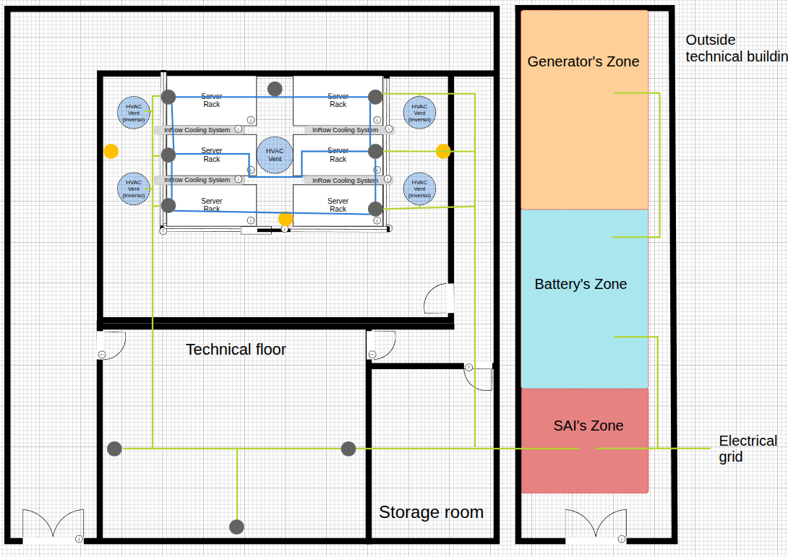
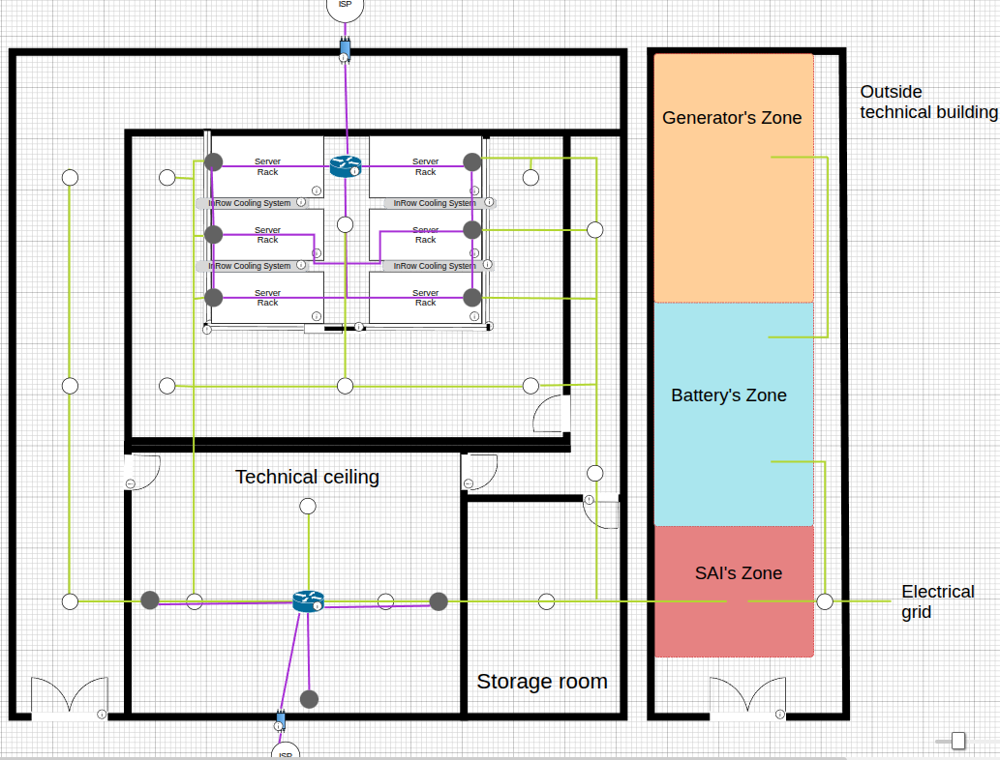
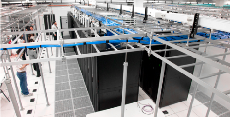
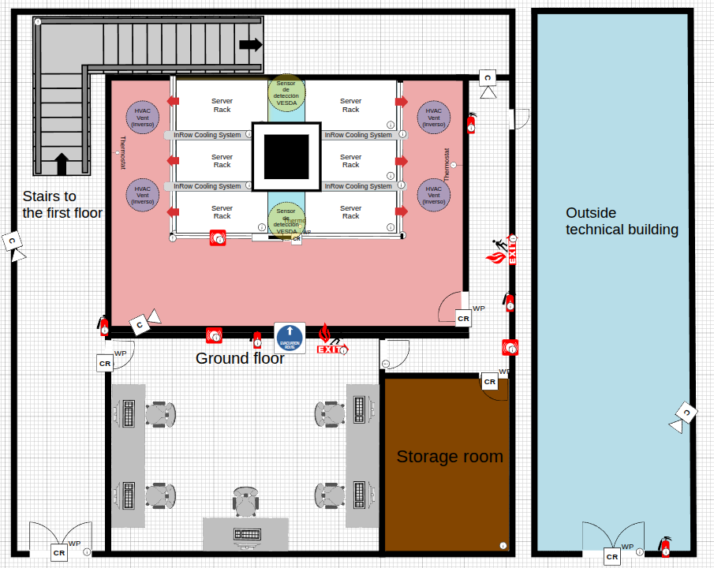
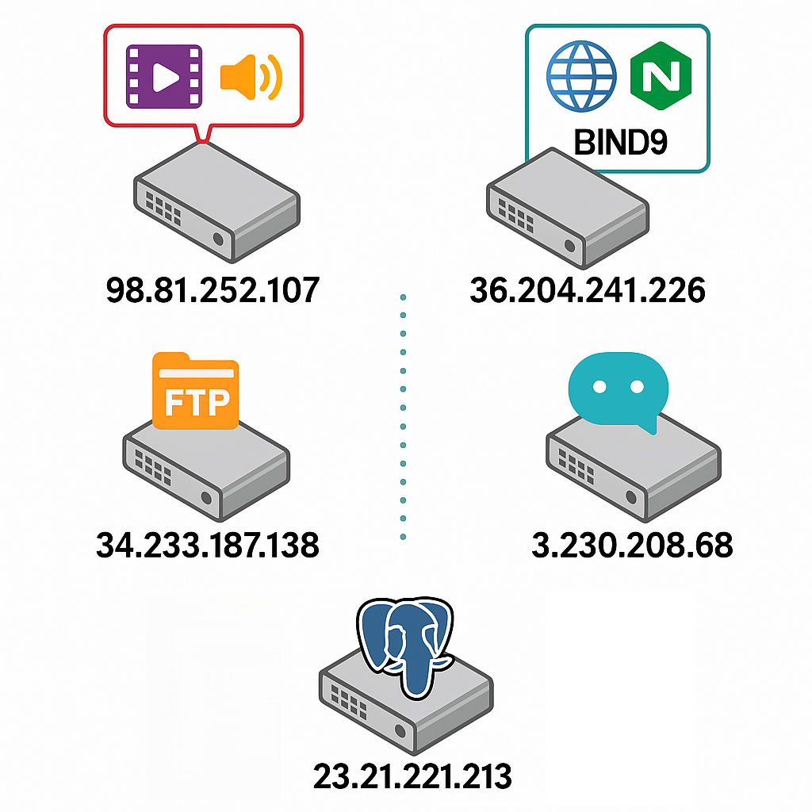

<h1 style="color: red; text-align: center; font-family: 'Montserrat', sans-serif; font-weight: bold; font-size: 64px;">THE CURE</h1>

# Propuesta de CPD

## Ubicación Física

La selección de las ubicaciones específicas para los CPD se basa en un análisis exhaustivo de factores como conectividad, accesibilidad, seguridad y huella ecológica. También hemos tenido en cuenta la actividad sísmica de cada una de las sedes propuestas a continuación.

Asimismo, proponemos tres ubicaciones estratégicas en España —Zaragoza, Bilbao y Santiago de Compostela—, cada una diseñada para cumplir roles específicos en la infraestructura híbrida de Innovate Tech. 

**Zaragoza**

En el nordeste de España, ha sido seleccionada como la ubicación del CPD principal debido a su posición como hub tecnológico emergente, respaldado por inversiones significativas de Amazon Web Services (AWS) previstas hasta 2030. 
La ciudad cuenta con una conectividad de fibra óptica de alta capacidad conectada al nodo ESpanix, lo que permite latencias inferiores a 10 ms hacia regiones cloud de AWS, como eu-west-3 en París, haciéndola ideal para soportar streaming multimedia en tiempo real. 
El suelo industrial en la zona logística de PLAZA es económico, lo que facilita la construcción de la nave industrial adaptada. Además, el 70% de la energía consumida en Zaragoza proviene de fuentes renovables, principalmente eólica y solar, complementada con paneles solares Sika SolarRoof de 20 kW y almacenamiento en baterías externas.

**Ubicación propuesta de CPD en Zaragoza**:

41.639983, -1.005463

C. Civitella, 12, 50197 Zaragoza

El clima semiárido de la región, con una temperatura media de 15°C, permite implementar free cooling durante 8-9 meses al año, logrando un Power Usage Effectiveness (PUE) de aproximadamente 1.3. La proximidad a la Universidad de Zaragoza y los clusters TIC locales garantiza acceso a talento técnico especializado.

---

**Bilbao**

Situada en el norte de España, será la sede del CPD secundario, diseñada para proporcionar redundancia, respaldo activo, balanceo de carga y recuperación ante desastres. La ciudad ofrece una conectividad robusta a través del punto de intercambio Bilbao IX y cables submarinos como Marea, serán clave en la escalabilidad de este proyecto.

Su clima oceánico, con una temperatura media de 13°C, es óptimo para free cooling durante todo el año, alcanzando un PUE de 1.2, uno de los más bajos de las ubicaciones propuestas.

Aproximadamente el 60% de la energía consumida en Bilbao es renovable, procedente de fuentes eólica e hidráulica, y se complementa con paneles solares de 15 kW instalados en la nave industrial, junto con sistemas de recuperación de calor residual que promueven la economía circular.

La zona industrial moderna de Zorrotzaurre, combinada con la presencia de la Universidad del País Vasco (UPV/EHU), facilita la gestión operativa y el acceso a personal cualificado.

**Ubicación propuesta de CPD en Bilbao**:

Zorrotzaurre

48014 Bilbao, Vizcaya

---

**Santiago de Compostela**

En el noroeste, funcionará como el CPD de respaldo pasivo, dedicado a copias de seguridad remotas, recuperación ante desastres y almacenamiento en frío. La región destaca por su liderazgo en energía renovable, con un 80% de su suministro proveniente de fuentes hidráulicas, lo que minimiza la huella de carbono de las operaciones. 
La nave industrial incluirá paneles solares de 10 kW para complementar el suministro energético. El clima templado de Santiago, con una temperatura media de 14°C, permite free cooling durante 10 meses al año, logrando un PUE de 1.25. 
Aunque el suelo industrial en esta región es más costoso, la estabilidad climática y la disponibilidad de talento técnico a través de la Universidad de Santiago compensan esta inversión. La red de fibra óptica de la ciudad es adecuada para soportar tráfico multimedia, haciendo de Santiago una ubicación estratégica para almacenamiento en frío y recuperación.

admin

**Ubicación propuesta de CPD en Santiago de Compostela**:

Rua M Angeles Gandara, 21, 15898 Santiago de Compostela, La Coruña

---

### Situación física de la sala

En cuanto a la ubicación física cada CPD estará ubicado dentro de una nave industrial diseñada y adaptada exclusivamente para alojar la infraestructura tecnológica crítica de InnovateTech. La nave tendrá un tamaño acorde a la cantidad de racks y equipos necesarios, con espacios técnicos auxiliares independientes.

La sala principal del CPD que contiene los racks de servidores, el cableado estructurado, los sistemas de refrigeración y las herramientas de monitorización estará situada en la planta baja, centralizada y alejada de las fachadas exteriores, con el propósito de minimizar el impacto térmico provocado por la radiación solar directa y facilitar un ambiente térmico estable y controlado. 

En el espacio restante de la planta baja se encontrarán las zonas habilitadas para el personal presencial, además de oficinas y almacenes. La sala no será identificable desde el exterior ni fácilmente accesible, garantizando la seguridad física mediante un control estricto y monitorizado de los accesos. Respecto a la primera planta, será destinada a los empleados, tanto baños como taquillas, salas de reuniones…

La distribución interior permitirá una gestión eficiente del cableado, energía y climatización, con un suelo/techo técnico para el paso ordenado del cableado y la gestión del flujo de aire. Esta disposición garantiza un acceso rápido y seguro a los equipos críticos, facilitando tareas operativas y de resolución de incidencias. 

En cuanto al edificio auxiliar exterior, por su parte, concentra las infraestructuras de apoyo, como los generadores, baterías y SAI, asegurando que las actividades de mantenimiento no afecten el funcionamiento de la sala de servidores. 

**Edificio Auxiliar**

Los sistemas de energía auxiliar y las instalaciones auxiliares se alojan en un edificio técnico exterior, separado físicamente de la sala de servidores, lo que permite realizar tareas de mantenimiento sin interferir en el entorno crítico de cada CPD. Este edificio auxiliar alberga los generadores eléctricos de emergencia, los bancos de baterías y los sistemas de alimentación ininterrumpida (SAI), garantizando una continuidad operativa robusta y un acceso seguro para el personal técnico.
Los generadores, que operan con diésel o gas natural, ofrecen una autonomía mínima de 48 horas, mientras que los SAI online de doble conversión, con una eficiencia del 95%, proporcionan una autonomía de 15 a 30 minutos, dependiendo de la ubicación del CPD. Los bancos de baterías, basados en tecnología de litio o AGM sellada, están alojados en armarios ventilados para cumplir con normativas de seguridad y sostenibilidad.
Para reforzar el compromiso sostenible, se instalarán paneles solares en el tejado del edificio principal de cada CPD, contribuyendo a la generación de energía renovable. Esta infraestructura energética renovable reduce la dependencia de fuentes no renovables y minimiza la huella de carbono de las operaciones.

---

### Sistema de climatización. Condiciones físicas y ambientales del CPD. 

El sistema de climatización implementado en el centro de procesamiento de datos (CPD) responde a una arquitectura híbrida de alta eficiencia energética, sostenibilidad ambiental y disponibilidad continua. Su diseño combina refrigeración de precisión mediante unidades InRow Cooling, ventilación forzada HVAC, tecnologías pasivas como free cooling y geotermia inversa, así como un sistema centralizado de gestión ambiental.

**Configuración Térmica: Pasillos Calientes y Fríos**

La disposición física del CPD se basa en la segregación de pasillos fríos y calientes, lo que permite optimizar la dirección del flujo térmico. Las temperaturas en los pasillos fríos se mantienen entre 20 °C y 24 °C con una humedad relativa controlada entre 45% y 55%, mientras que en los pasillos calientes se alcanzan temperaturas de entre 30 °C y 38 °C. Esta disposición permite capturar el aire caliente en su punto de máxima concentración y facilita su tratamiento térmico inmediato.

**Refrigeración de Precisión con InRow Cooling**

Se instalan unidades de refrigeración InRow Cooling entre los racks, alineadas con los pasillos calientes. Estas unidades capturan el aire caliente directamente donde se genera y lo recirculan como aire frío, lo que incrementa la eficiencia térmica y reduce el consumo energético. Equipadas con sistemas de control dinámico y distribuido, las unidades ajustan su potencia en tiempo real en base a las lecturas de sensores térmicos ubicados en pasillos fríos, calientes y a nivel de rack.
Gracias a esta estrategia, se alcanza un Power Usage Effectiveness (PUE) estimado entre 1.2 y 1.3, en función de la ubicación geográfica del CPD (Zaragoza, Bilbao o Santiago de Compostela).

## Sistemas HVAC

Se compone de una red de conductos unidireccionales distribuidos perimetralmente en la sala técnica, que extraen el aire caliente generado por los equipos y descargan térmicamente las unidades InRow, optimizando su rendimiento. La extracción se regula mediante ventiladores de velocidad variable con motores de corriente continua, que ajustan su potencia según la carga térmica para evitar ineficiencias como turbulencias o caídas de presión.

Para compensar la depresión generada y garantizar un flujo continuo, un conducto central inyecta aire frío tratado, equilibrando la presión y mejorando la distribución térmica. Todos los flujos pasan por filtros HEPA, que eliminan partículas finas, garantizando un entorno limpio conforme a los estándares de salas blancas y electrónica sensible.

### Integración de Geotermia Inversa
El sistema incorpora un circuito de geotermia inversa como solución pasiva para disipar el calor residual. El aire caliente no reciclado es canalizado por conductos subterráneos donde intercambia calor con el subsuelo, reduciendo su temperatura antes de ser expulsado al exterior y disminuyendo así la necesidad de refrigeración activa. Disminuyendo considerablemente la contaminación térmica.

Además, el conducto central puede operar en modo geotermia directa si se detectan caídas de presión o déficit térmico: se introduce aire exterior que se enfría de forma natural al atravesar el circuito subterráneo antes de llegar a la sala.

Cuando las condiciones exteriores lo permiten, el sistema aprovecha el free cooling indirecto: se reduce el uso de refrigeración mecánica y se introduce aire tratado del exterior a través de los circuitos geotérmicos o intercambiadores. Esta estrategia mantiene condiciones óptimas durante la mayor parte del año. La duración del modo free cooling varía según la ubicación: todo el año en Bilbao, hasta 10 meses en Santiago y entre 8 y 9 en Zaragoza. Para optimizar el rendimiento, los ventiladores se controlan electrónicamente y emplean motores de corriente continua de alta eficiencia.

**Redundancia, Estabilidad y Gestión Ambiental**

Todo el sistema está diseñado con una configuración de redundancia N+1 en las unidades InRow y los ventiladores. Esto garantiza la continuidad operativa incluso en caso de fallo de uno de los componentes, cumpliendo con los estándares TIER II+/III.
Se dispone de una plataforma de gestión centralizada (como Schneider Electric EcoStruxure), que integra sensores de temperatura, humedad, calidad del aire (CO₂ y partículas), presión y flujo. Esta plataforma permite la visualización en tiempo real de las condiciones ambientales, emite alertas automáticas, ejecuta ajustes dinámicos de los sistemas térmicos, y almacena registros históricos para análisis predictivo a través de soluciones como Prometheus y Grafana.

**Control de Humedad y Calidad del Aire**

El control higrométrico se realiza mediante sensores distribuidos y actuadores que regulan humidificadores y deshumidificadores automáticos, manteniendo una humedad relativa constante entre 45% y 55%. La calidad del aire es monitorizada en tiempo real y los filtros HEPA aseguran una atmósfera libre de contaminantes.

---
## Estrategias de protección integral de la infraestructura

**Medidas para dificultar la identificación de la sala**

Para garantizar la seguridad física y operativa de sus infraestructuras críticas, InnovateTech ha dispuesto implementar un conjunto de medidas orientadas a dificultar la identificación de la sala del Centro de Procesamiento de Datos (CPD), alineadas con estándares internacionales como ISO/IEC 27001, ANSI/TIA-942 e ISO 22301. Estas estrategias priorizan la discreción arquitectónica, el control de accesos, la segregación funcional de espacios y la vigilancia continua, promoviendo una infraestructura robusta y resiliente, acorde con los ODS 9, 11 y 16.

El edificio que alberga el CPD presenta una fachada opaca y sin elementos distintivos, construida en un acabado blanco uniforme, sin cristales ni señalética que sugiere su función tecnológica. El único identificador es una rotulación mínima con el nombre corporativo, evitando toda referencia directa al CPD.

La zona técnica exterior, donde se alojan sistemas auxiliares como generadores y UPS, está ubicada lateralmente en un espacio cerrado, inaccesible al público y sin visibilidad directa desde la vía pública. El acceso se restringe mediante tarjeta y código, con vigilancia permanente. Internamente, la señalización se mantiene neutra: las puertas del CPD llevan designaciones técnicas genéricas, sin indicaciones que revelen la función de la sala.

**Sistema de Videovigilancia**

Se recomienda el diseño de un sistema de videovigilancia IP de alta disponibilidad para sus Centros de Procesamiento de Datos en Zaragoza, Bilbao y Santiago de Compostela. Este sistema opera 24/7 y ofrece cobertura total de las áreas críticas, sin puntos ciegos, integrando tecnologías como visión nocturna, detección por IA, análisis de comportamiento y almacenamiento redundante.

Las cámaras —ubicadas en accesos, zonas técnicas, salas de racks, SAIs y generadores— capturan video en 4K o Full HD según la criticidad del área. Las funciones inteligentes permiten alertas automáticas ante comportamientos inusuales, integradas con sistemas de monitoreo como Prometheus y Grafana. Contarán con visión nocturna que cubre todas las rutas de acceso, incluyendo pasillos, almacenes, escaleras y la zona técnica exterior.Las grabaciones se almacenan de forma cifrada y redundante en un NAS con replicación entre sedes y backups diarios en almacenamiento frío, se cifran (AES-256) con retención de 90 días y se gestionan desde una consola remota restringida.

Imagen referencial de los equipos del sistema de videovigilancia

### Distribución y Gestión del Cableado

Esta infraestructura garantiza una operativa segura y ordenada, compatible con futuras ampliaciones sin necesidad de rediseños estructurales.

Los diferentes tipos de cableado —eléctrico, red (Cat6A), fibra óptica (LC/SC) y sensores— se distribuyen mediante canalizaciones separadas por tipo y función. Las bandejas de datos y energía discurren por rutas independientes al sistema HVAC, evitando interferencias térmicas o electromagnéticas. Se ha establecido una clara segregación física entre las redes de empleados y de servidores, tanto a nivel de canalización como de interconexión en patch panels y switches.

El suelo técnico elevado alberga el cableado de red principal, con acceso seguro para tareas de mantenimiento y distribución eficiente del aire mediante ventiladores encapsulados. Los elementos de iluminación se canalizan por el falso techo para preservar la separación funcional. El diseño de canalización vertical mediante columnas organizadoras y patch panels blindados optimiza el flujo de cables entre el suelo y los racks, garantizando un rendimiento estable y protección frente a EMI.

La capacidad de red está respaldada por una infraestructura robusta de switches core (Cisco Nexus 9300, Arista 7050X) y switches de acceso 10 Gbps, dimensionados para soportar tráfico crítico de datos y streaming sin cuellos de botella. Los puertos están estrictamente controlados y segmentados, restringiendo el acceso físico y lógico a las zonas de servidores.

Cada tipo de cable está codificado por colores y etiquetado con identificadores únicos que permiten trazabilidad digital a través de un sistema DCIM integrado en Schneider Electric EcoStruxure. Este sistema facilita la gestión proactiva del cableado, monitoriza su estado en tiempo real mediante Prometheus y Grafana, y soporta mantenimiento predictivo y expansión eficiente.

El resultado es una red de cableado resiliente, accesible y limpia, alineada con los objetivos de rendimiento, sostenibilidad y seguridad requeridos por las operaciones críticas de InnovateTech. Su diseño favorece la escalabilidad, el orden operativo y la continuidad del servicio, consolidando a los CPD como infraestructura de referencia en eficiencia tecnológica.

### Suelo Técnico y Falso Techo Técnico

La arquitectura del (CPD) incorpora el suelo técnico elevado y el falso techo técnico como componentes estructurales y funcionales esenciales. Estos elementos permiten una organización vertical y lógica de la infraestructura eléctrica y de comunicaciones, facilitando el mantenimiento, garantizando la seguridad operativa y contribuyendo a la eficiencia térmica del conjunto. La separación física de los sistemas, especialmente los eléctricos y los de transmisión de datos, es fundamental para evitar interferencias, preservar la integridad de la señal y asegurar la continuidad operativa en entornos de misión crítica.

#### Suelo Técnico

En la sala técnica del CPD, el suelo técnico elevado se configura mediante módulos de alta resistencia dispuestos sobre una estructura metálica que proporciona una altura libre aproximada de 30 centímetros. Este volumen inferior actúa como corredor técnico donde se alojan múltiples sistemas, entre ellos las canalizaciones secundarias eléctricas (cableado amarillo) y los circuitos de datos (cableado azul) de nivel intermedio. La red eléctrica secundaria incluye líneas de distribución monofásicas o trifásicas destinadas a alimentar equipamiento específico dentro de los racks, como servidores, unidades de almacenamiento y dispositivos de red, todo ello protegido mediante electrocanales metálicos apantallados que minimizan la emisión de campos electromagnéticos. Esta red se considera secundaria porque depende de la infraestructura eléctrica primaria situada en el falso techo o en salas técnicas adyacentes, y se mantiene separada para evitar acoplamientos inductivos con las señales de datos.
En paralelo a estas canalizaciones, discurren los cables de datos correspondientes al cableado estructurado horizontal. Este cableado incluye tanto enlaces de cobre, generalmente en categoría 6A o superior, como enlaces de fibra óptica multimodo (OM4 o superior), y en algunos casos enlaces de fibra monomodo, destinados a conectar los racks con los switches de distribución o los paneles de parcheo. Los trayectos están organizados mediante bandejas portacables, canaletas y organizadores que permiten un tendido ordenado, accesible y conforme a las normativas TIA-942 y EN 50600. Además, se implementan radios de curvatura específicos y distancias mínimas de separación entre líneas eléctricas y líneas de datos para evitar interferencias y garantizar el rendimiento de la red. En algunos casos, los cables de datos en el suelo técnico están destinados a enlaces redundantes de bajo nivel, de forma que su desconexión no comprometa la operatividad del sistema, pero sí permita una rápida reconfiguración ante fallos en la red principal.

#### Falso Techo Técnico

El falso techo técnico, suspendido entre 2.5 y 3 metros de altura, cumple una función estratégica en la distribución de cableado estructurado y potencia de alto nivel. Aquí se aloja la red eléctrica principal del CPD (cableado amarillo), que comprende conductores de gran sección para la distribución de energía trifásica desde los cuadros generales hasta las subdistribuciones o puntos de entrega a racks. Estas líneas están contenidas en bandejas de seguridad ignífugas, con aislamiento reforzado y señalización clara, cumpliendo con las normativas de baja tensión y protección contra incendios.

Junto a estas líneas eléctricas, el falso techo contiene el cableado estructurado principal de comunicaciones (cableado morado), que constituye el backbone del centro de datos. Este cableado incluye enlaces de fibra óptica, tanto monomodo como multimodo, empleados para conexiones de alta velocidad entre salas técnicas, switches core y elementos de interconexión interedificio. También se alojan enlaces de cobre apantallado (STP o S/FTP) para servicios auxiliares o de gestión, especialmente en sistemas que requieren sincronización precisa o alimentación mediante PoE. A diferencia del cableado del suelo técnico, los enlaces ubicados en el falso techo corresponden a la red troncal (backbone), lo que implica que transportan el grueso del tráfico de datos del CPD y deben estar protegidos con mayores medidas de redundancia, trazabilidad y supervisión.
Todo el cableado en el falso techo se organiza mediante sistemas de bandejas, conductos cerrados y etiquetas normalizadas, y es supervisado mediante sensores de temperatura, humedad y presencia que permiten detectar sobrecargas, puntos calientes o degradación progresiva. Además, se aplican rutas diferenciadas para la fibra óptica y el cobre, y se mantiene una estricta segregación con respecto a las líneas eléctricas, utilizando pantallas metálicas o separaciones físicas. Estas prácticas no solo responden a criterios de ingeniería de telecomunicaciones, sino también a requisitos normativos de continuidad operativa y certificaciones como TIER III o IV.

El diseño del cableado en ambas capas, tanto en el suelo técnico como en el falso techo, permite una gestión flexible, escalable y segura, acorde con las necesidades de un entorno de misión crítica. Cada nivel tiene una función definida en la arquitectura de red, garantizando que el mantenimiento, las ampliaciones o las intervenciones de emergencia puedan realizarse sin afectar a la disponibilidad del servicio ni a la integridad de la infraestructura.

Diseño de techo técnico y distribución de cableado

La combinación de ambas estructuras ofrece una organización vertical eficiente y segura del entorno técnico, compatible con las exigencias normativas y adaptable a la evolución futura del CPD.

---

### Planos, dibujos, diagramas de los elementos anteriormente citados.

---

### Estructuración de los racks

La estructuración de los racks ha sido diseñada para garantizar alta disponibilidad, eficiencia energética y escalabilidad. Distribuidos en **Zaragoza, Bilbao y Santiago de Compostela**, los CPDs responden a funciones diferenciadas y coordinadas que permiten asegurar la continuidad operativa.

La infraestructura se basa en un diseño **modular, replicable y sostenible**, que integra servidores blade de alto rendimiento, almacenamiento redundante mediante NAS enterprise, redes con alta capacidad de transferencia y sistemas de respaldo energético gestionados de forma inteligente. La replicación activa entre sedes y la separación de roles operativos aseguran resiliencia ante fallos y eficiencia en la distribución de cargas críticas y no críticas.

### CPD Principal – Zaragoza

Ubicado como nodo central de operación, Zaragoza alberga **seis racks de 42U** configurados para soportar servicios esenciales: sitio web, bases de datos, autenticación, backups y almacenamiento híbrido conectado con AWS.

#### Componentes destacados:

- **Servidores blade**: Seis por rack, con CPUs Intel Xeon duales, 512 GB RAM y almacenamiento SSD/NVMe.
- **Base de datos**: Dos servidores en alta disponibilidad con replicación interna y externa.
- **Autenticación**: Un servidor redundante bajo LDAP/RADIUS.
- **Monitorización**: Un servidor con SNMP, Prometheus y Grafana para alertas y visibilidad proactiva.
- **NAS**: TrueNAS Enterprise con 10 discos de 14 TB en RAID Z2, SSD para caché y disco hot spare, con replicación hacia Bilbao.
- **Red**:
  - Dos switches core (10/40/100 Gbps, Cisco Nexus)
  - Dos switches de acceso (48 puertos, 10 Gbps)
  - Firewalls redundantes con IPS/IDS
- **Energía**: PDU inteligente y SAI de 6 kVA por rack con autonomía de 30 minutos.
- **Climatización**: Pasillos frío/caliente con sensores térmicos adaptativos.

### CPD Secundario – Bilbao

Funciona como respaldo activo y sitio de recuperación ante desastres. Cuenta con **cuatro racks de 42U**, replicando parcialmente la funcionalidad de Zaragoza para garantizar la continuidad operativa.

#### Componentes destacados:

- **Servidores blade**: Cuatro por rack, con las mismas especificaciones que Zaragoza.
- **Base de datos**: Réplicas sincronizadas con Zaragoza.
- **Servicios secundarios**: Autenticación, backups incrementales y monitorización.
- **NAS**: TrueNAS replicado bidireccionalmente, con ocho discos de 14 TB en RAID Z2.
- **Red**: Conectividad redundante de 10 Gbps por servidor, con switches y firewalls en configuración dual.

### CPD Pasivo – Santiago de Compostela

Diseñado para almacenamiento en frío, respaldo remoto y activación en contingencias mayores. Opera con bajo consumo y mínima intervención activa.

#### Componentes destacados:

- **Servidores**: Dos multiuso en espera/apagado y un servidor para backups incrementales.
- **NAS**: Unidad TrueNAS con cuatro discos de 14 TB en RAID Z1, optimizada para eficiencia energética.
- **Red**: Switch básico con redundancia mínima.

Los racks en todos los CPD comparten estándares comunes que garantizan consistencia y eficiencia. Cada rack, con un formato estándar de 42U, tiene un consumo medio estimado de 6 a 8 kW, optimizado para alta densidad de potencia y eficiencia energética, contribuyendo a un PUE de 1.2-1.3. La refrigeración utiliza un sistema de pasillo frío/caliente con sensores térmicos que ajustan dinámicamente el flujo de aire, manteniendo las temperaturas entre 20°C y 24°C. La gestión remota se realiza mediante interfaces iDRAC/IPMI en todos los servidores, con paneles web seguros para los NAS, asegurando un control completo desde ubicaciones remotas. La red proporciona una conectividad mínima de 10 Gbps por servidor, con redundancia completa en switches core y firewalls, utilizando protocolos de enrutamiento dinámico como BGP para optimizar el tráfico. Los SAIs dobles, con autonomías de 30 minutos para racks activos y 15 minutos para racks pasivos, garantizan la continuidad operativa. El almacenamiento, basado en NAS rackeables TrueNAS, soporta configuraciones RAID Z2/Z1 con discos hot spare y caché SSD, permitiendo exportación de volúmenes vía iSCSI. La replicación activa entre Zaragoza y Bilbao, junto con copias pasivas en Santiago, asegura la protección y recuperación de datos. Las PDUs inteligentes, integradas con plataformas DCIM como Schneider Electric EcoStruxure, permiten monitorización energética por dispositivo, optimizando el consumo y apoyando el compromiso de InnovateTech con la sostenibilidad.

---

---
## Infraestructura IT

### Infraestructura de Servidores

La infraestructura de servidores en los Centros de Procesamiento de Datos (CPD) de **Innovate Tech** ha sido diseñada bajo criterios de **alto rendimiento, escalabilidad y eficiencia energética**, consolidando una plataforma robusta y resiliente para el soporte de servicios críticos, virtualización, gestión de datos y almacenamiento.

Como núcleo operativo de la infraestructura, el **CPD de Zaragoza** alberga **seis racks**, cada uno equipado con **seis servidores blade**, totalizando **36 unidades físicas**. Se emplean modelos de alto rendimiento como *Dell PowerEdge M640* o *HPE ProLiant BL460c Gen10*, seleccionados por su compatibilidad con entornos virtualizados y su eficiencia térmica.

#### Especificaciones de los servidores blade:

- 2 CPUs Intel Xeon Silver/Gold (mín. 16 núcleos c/u)
- 512 GB de memoria DDR4 ECC
- Almacenamiento SSD/NVMe dedicado al sistema operativo y servicios críticos
- Interfaces de administración remota iDRAC/IPMI
- Módulo TPM 2.0, habilitando cifrado en reposo y cumplimiento con normativas como GDPR

El **almacenamiento centralizado** está gestionado mediante un **NAS rackeable TrueNAS Enterprise**, con discos SSD configurados en **RAID Z2**, unidades *hot-spare*, conectividad **iSCSI** y **replicación activa** hacia el CPD de **Bilbao**.

---

El **CPD de Bilbao** actúa como **respaldo activo** y sitio de **continuidad operativa**, desplegado en **cuatro racks** con un total de **16 servidores blade**, que replican las especificaciones de Zaragoza para asegurar **consistencia y compatibilidad operativa**.

#### Distribución funcional:

- 2 servidores de base de datos replicados
- 1 servidor de autenticación secundaria
- 1 servidor de monitorización
- 1 servidor de backups incrementales

El almacenamiento se basa en un **NAS TrueNAS** con conectividad **iSCSI**, configurado para **replicación bidireccional con Zaragoza**, asegurando disponibilidad de datos y sincronización continua.

Este sitio está preparado para absorber carga en escenarios de mantenimiento, fallo o escalado, habilitando estrategias de *disaster recovery* con conmutación casi inmediata.

---

Diseñado como una solución de **respaldo pasivo y almacenamiento en frío**, el **CPD de Santiago** alberga **dos racks** con:

- 2 servidores blade multiuso en modo espera o apagados para activación bajo demanda
- 1 servidor dedicado a backups remotos
- 1 NAS para almacenamiento en frío, configurado con **RAID Z1** y enfoque en **bajo consumo energético**

Esta infraestructura ligera está optimizada para garantizar la **integridad de los datos sin incrementar los costos operativos**, actuando como **última línea de defensa** ante fallos mayores en los CPD activos.
---

### Patch Panels y Switches

La arquitectura de conectividad de los Centros de Procesamiento de Datos (CPDs) de **Innovate Tech** está diseñada para asegurar una infraestructura de red **robusta, ordenada y resiliente**. En conjunto, los **patch panels** y **switches** conforman la columna vertebral de la conectividad interna y externa, permitiendo un flujo de datos eficiente y seguro entre los distintos componentes del sistema.

#### Patch Panels

Cada rack, ubicado en los diferentes sitios del cliente, está equipado con **dos patch panels CAT6A** en su parte superior, con capacidades de entre **24 y 48 puertos** según las necesidades de conectividad. Se utilizan marcas de alto estándar como **TE Connectivity** o **Panduit**, garantizando soporte para velocidades de hasta **10 Gbps**.

#### Switches Core

Cada CPD dispone de **dos switches core redundantes** que actúan como el **núcleo de la red**, interconectando racks, servicios internos y enlaces externos (incluyendo regiones cloud como *AWS eu-west-3*). Estos switches empresariales están diseñados para entornos de **alta disponibilidad**, operando con velocidades de **10, 40 y hasta 100 Gbps**.

#### Switches de Acceso

Dentro de cada rack se instalan **dos switches de acceso redundantes de 48 puertos** (10 Gbps por puerto), conectados directamente a los **patch panels CAT6A**. Estos switches, como los **Cisco Catalyst 9300** o **Arista 7020R**, están diseñados para ofrecer **conectividad densa y baja latencia**, esenciales para servicios sensibles como **bases de datos**, **autenticación** y **streaming de medios**.

#### Diseño de Red: Redundancia y Gestión

La red está concebida con **redundancia completa** tanto en **capa 2 como en capa 3**. Se implementan protocolos como:

- **RSTP (Rapid Spanning Tree Protocol)** para evitar bucles de red.

- **OSPF** para enrutamiento dinámico y recuperación automática ante fallos.

- **VLANs aisladas** para servicios críticos (*LDAP/RADIUS*, bases de datos, monitorización).

---

## Infraestructura eléctrica

La infraestructura eléctrica propuesta para los Centros de Procesamiento de Datos (CPD) de InnovateTech responde a criterios de alta disponibilidad, eficiencia energética y escalabilidad, conforme a estándares internacionales como ANSI/TIA-942 (TIER II+/III), ISO/IEC 27001, y la Directiva (UE) 2023/1791 sobre eficiencia energética.

El sistema eléctrico parte de una doble acometida desde transformadores independientes, cuando sea técnicamente viable, con rutas físicas separadas hasta los cuadros de distribución, eliminando puntos únicos de fallo. La energía se distribuye mediante buses eléctricos redundantes A/B, conectados a cada rack desde fuentes independientes, lo que permite mantener operativos los equipos críticos incluso ante la caída de una línea. El cableado se organiza a través de canaletas técnicas elevadas, protegidas y accesibles desde el suelo técnico, utilizando materiales ignífugos y dieléctricos que reducen el riesgo de fallos térmicos o eléctricos.

El diseño contempla sistemas de alimentación ininterrumpida (SAIs) online de doble conversión con módulos trifásicos de alta eficiencia, dimensionados según la carga crítica de cada CPD. 

En Zaragoza, con mayor densidad de servidores, se proyectan soluciones escalables con autonomía mínima de 30 minutos, eficiencia superior al 95% y baterías de litio o AGM alojadas en armarios ventilados. 

En Bilbao, la solución replica este esquema con menor capacidad, manteniendo la redundancia operativa. Santiago, como nodo de respaldo con funciones de almacenamiento pasivo, adopta SAIs compactos en modo standby, con autonomía de 15 minutos, diseñados para minimizar el consumo y permitir cierres ordenados o comunicación con los CPD activos. En todos los casos, los SAIs se integran con PDUs inteligentes que permiten la monitorización precisa del consumo por rack y dispositivo.

El respaldo ante cortes prolongados se plantea mediante generadores de arranque automático, con tiempo de respuesta inferior a 10 segundos y autonomía mínima de 48 horas, ampliable mediante depósitos auxiliares.

| Elemento                  | CPD Zaragoza                                      | CPD Bilbao                                         | CPD Santiago                         |
|---------------------------|----------------------------------------------------|----------------------------------------------------|--------------------------------------|
| **SAIs (autonomía mínima)** | 30 minutos a plena carga                          | 30 minutos a plena carga                          | 15 minutos a plena carga             |
| **Generadores**           | 48 horas (con opción de ampliación mediante depósito externo) | 48 horas                                           | 48 horas                             |
| **Baterías (en SAIs)**    | Tipo AGM/litio, optimizadas para 95–98% eficiencia | Idéntico                                           | Adaptado para bajo consumo           |

*Tabla 1. Tiempos de autonomía por sistema eléctrico*

Estos sistemas se proyectan en versiones alimentadas por diésel de baja emisión o gas natural, según disponibilidad y normativa local, e integran mecanismos de reducción de emisiones. La monitorización de estos equipos incluye nivel de combustible, estado mecánico y alertas de mantenimiento, todo accesible desde una plataforma segura de gestión energética.

La supervisión integral de la infraestructura eléctrica se centraliza en un sistema de gestión energética (EMS) integrado con la plataforma de monitorización global del CPD. Esta solución permite visualizar en tiempo real parámetros como el consumo energético por línea, estado de carga de baterías, funcionamiento de generadores y eficiencia de los SAIs, facilitando tanto la toma de decisiones como el mantenimiento preventivo. Las métricas energéticas se visualizan a través de Elastic y Kibana, dentro de un entorno seguro con autenticación multifactor, garantizando trazabilidad, continuidad operativa y cumplimiento normativo.

Este enfoque eléctrico, orientado a la eficiencia y resiliencia, contribuye a mantener un Power Usage Effectiveness (PUE) en el rango objetivo de 1.2–1.3, posicionando los CPD de InnovateTech como una referencia en sostenibilidad, continuidad tecnológica y alineación con buenas prácticas internacionales en infraestructuras críticas.

| Nivel                    | Tipo de carga                                                                                                       | Acción recomendada ante apagón prolongado                                                |
|--------------------------|----------------------------------------------------------------------------------------------------------------------|-------------------------------------------------------------------------------------------|
| **Crítico (Nivel 1)**     | Servidores de core de servicios, almacenamiento de datos en producción, red principal, firewalls, sistemas de autenticación y backup activo. | Mantener siempre activos.                                                                |
| **Intermedio (Nivel 2)**  | Equipos de desarrollo, entornos de staging, sistemas HVAC secundarios, videovigilancia no perimetral.               | Apagar progresivamente tras 10-15 minutos si no se restablece energía.                  |
| **No crítico (Nivel 3)**  | Iluminación general de oficinas técnicas, puestos de usuario local, sistemas de backup pasivo o en frío, pantallas de videowall, sensores secundarios. | Apagar en los primeros 5 minutos para prolongar la autonomía.                            |

*Tabla 2. Niveles de criticidad de equipos y sus acciones ante apagón*

### Sistema de alimentación redundante

El sistema de alimentación redundante de los Centros de Procesamiento de Datos (CPD) de **InnovateTech** ha sido diseñado bajo el principio de **confiabilidad N+1/N+N**, garantizando que la caída de un componente individual no afecte la operación continua de las cargas críticas. Este diseño se enmarca dentro de los requisitos de disponibilidad definidos por **ANSI/TIA-942 TIER II+/III**, ofreciendo un equilibrio entre coste operativo y resiliencia eléctrica.

Cada CPD cuenta con **dos rutas eléctricas independientes** (**Ruta A** y **Ruta B**) desde la acometida principal hasta el nivel de distribución secundaria, asegurando que los equipos críticos dispongan siempre de al menos una fuente activa. Esta distribución dual permite realizar tareas de mantenimiento preventivo o correctivo en una ruta sin interrumpir el suministro eléctrico, lo cual es esencial en entornos 24x7.

Ambas rutas están dotadas de **paneles de distribución eléctricos (PDU)** redundantes, con capacidad de **failover automático o manual** según el tipo de carga, conectados a **SAIs de conversión online** independientes. Los servidores blade, dispositivos de red y sistemas de almacenamiento están cableados con **doble entrada de alimentación** y **tomas de corriente diferenciadas**, minimizando el riesgo de fallo por cortocircuito, sobrecarga o desconexión accidental.

#### Redundancia por Niveles

- **Nivel 1: Acometida y Transformadores**  
Cuando es técnicamente viable, se instalan dos acometidas independientes desde transformadores distintos. En caso contrario, se implementan **anillos de media tensión** con derivaciones automáticas de transferencia (ATS).

- **Nivel 2: SAIs y Distribución Secundaria**  
Cada ruta A/B está alimentada por un **SAI independiente**. En **Zaragoza y Bilbao**, se adopta un esquema **N+1 con posibilidad de expansión modular sin interrupciones** (hot swap). En **Santiago**, el sistema está en modo pasivo (standby) y se activa sólo bajo demanda.

- **Nivel 3: Alimentación en Racks (PDUs inteligentes)**  
Se utilizan **PDUs con redundancia física y lógica**, controladas remotamente, capaces de conmutar la carga en caso de fallo o mantenimiento. Esta capa incorpora **sensores de temperatura, amperaje y consumo por toma**, integrados en el sistema EMS.

- **Nivel 4: Generadores Redundantes (Failover automático)**  
Aunque se dispone de un único generador por CPD, se plantea la **preinstalación para grupos dobles en paralelo (N+1)**, especialmente en Zaragoza, permitiendo ampliar la capacidad sin rediseñar la infraestructura. Los **sistemas ATS** garantizan el traspaso automático sin cortes.

Este enfoque **modular y redundante** reduce la probabilidad de interrupción no planificada y permite una **tasa de disponibilidad eléctrica superior al 99.982%**, que es el umbral definido para instalaciones **TIER III**. Además, facilita la **gestión predictiva y escalabilidad futura**, adaptándose a aumentos de carga por virtualización, IA o servicios cloud híbridos.

### Sistema de Alimentación Sostenible y Plan de Autonomía para CPDs

La estrategia energética de InnovateTech para sus Centros de Procesamiento de Datos (CPD) en Zaragoza, Bilbao y Santiago de Compostela combina una infraestructura eléctrica de alta resiliencia con soluciones sostenibles para garantizar la continuidad operativa, incluso durante cortes eléctricos prolongados. Este diseño integra sistemas de alimentación ininterrumpida (SAIs), generadores de respaldo, baterías de litio de última generación y energía solar fotovoltaica, asegurando un equilibrio entre fiabilidad, eficiencia energética y reducción del impacto ambiental. Cada CPD ha sido configurado según su función específica: Zaragoza como nodo principal de alta densidad, Bilbao como sitio intermedio con redundancia operativa, y Santiago como nodo pasivo para almacenamiento frío y recuperación ante desastres. Esta planificación optimiza la gestión de cargas críticas, la autonomía eléctrica y la escalabilidad futura, posicionando a InnovateTech como líder en infraestructuras energéticamente responsables.

La estimación de las cargas eléctricas en cada CPD se basa en la función operativa, la densidad de equipos y la criticidad de los servicios, segmentando el consumo en niveles crítico (60%), intermedio (25%) y no crítico (15%) para reflejar las necesidades reales. En Zaragoza, el CPD principal, que soporta hasta 20-25 racks de alto rendimiento, tiene una carga total estimada de 100 kW, con 60 kW para sistemas críticos como servidores de producción, red principal y firewalls, 25 kW para servicios intermedios, y 15 kW para equipos no esenciales. Bilbao, con 10-12 racks enfocados en redundancia y entornos de desarrollo, consume aproximadamente 50 kW, distribuidos en 30 kW críticos, 12.5 kW intermedios y 7.5 kW no críticos. Santiago, diseñado para almacenamiento frío y operación mínima, tiene una carga de 15 kW, con 9 kW críticos, 3.75 kW intermedios y 2.25 kW no críticos. Estas cifras, calculadas considerando un PUE de 1.2-1.3 y cargas promedio por rack de 1.5 a 5 kW, permiten dimensionar un sistema eléctrico que mantenga las operaciones críticas durante al least 30 minutos mediante SAIs, con respaldo adicional de generadores y energía solar.

Para garantizar la autonomía eléctrica, cada CPD utiliza baterías de litio LiFePO4, seleccionadas por su alta eficiencia (95-98%), densidad energética, vida útil superior a 6000 ciclos y reciclabilidad. En Zaragoza, las cargas críticas de 60 kW requieren 30 kWh para una autonomía de 30 minutos, cubiertas por 14 módulos de 5 kWh en un esquema redundante dual A/B con configuración N+1 por ruta, asegurando fiabilidad incluso ante fallos de un módulo. Bilbao, con 30 kW críticos, necesita 15 kWh, soportados por 7 módulos en un esquema similar. Santiago, con 9 kW críticos y una autonomía de 15 minutos, utiliza 3 módulos de 5 kWh en una ruta única en modo standby, suficiente para su función pasiva. Las baterías, basadas en tecnologías como BYD Battery-Box Premium, Huawei LUNA2000 o Pylontech US5000, se conectan a SAIs trifásicos online de doble conversión, como Huawei UPS5000-E, Eaton 93PM o Schneider Galaxy VS, con capacidad modular escalable para adaptarse a futuras expansiones. Este diseño asegura una respuesta inmediata ante cortes eléctricos, protegiendo los servicios críticos sin interrupciones.

La integración de energía solar fotovoltaica reduce la dependencia de la red eléctrica y extiende la autonomía de los sistemas de respaldo. En Zaragoza, un sistema de 50 kWp genera aproximadamente 70 MWh al año, alimentando SAIs, racks críticos y cargando baterías durante las horas solares. Bilbao, con 30 kWp, produce 42 MWh anuales, cubriendo parcialmente la carga base y soportando los SAIs. Santiago, con 10 kWp, genera 14 MWh al año, suficiente para sistemas en standby y climatización básica. Los inversores híbridos conectan los paneles solares directamente a las baterías, permitiendo una reducción del 15-25% en el consumo de red durante el día y un respaldo energético adicional en caso de fallos. Esta configuración no solo mejora la sostenibilidad, sino que también optimiza los costos operativos a largo plazo.

El plan de acción ante un corte eléctrico prioriza las cargas críticas, manteniéndolas activas mediante baterías, SAIs y generadores, mientras que las cargas intermedias se desconectan progresivamente tras 10-15 minutos, utilizando SAIs breves y energía solar residual. Las cargas no críticas se apagan en los primeros 5 minutos, liberando recursos para los sistemas esenciales. Este protocolo asegura una gestión eficiente de la energía disponible, maximizando la autonomía de los servicios prioritarios. Los generadores de arranque automático, activados en menos de 10 segundos, proporcionan una autonomía mínima de 48 horas, ampliable con depósitos auxiliares. En Zaragoza, la infraestructura está preparada para incorporar un segundo generador en paralelo (esquema N+1) para mayor resiliencia, mientras que Bilbao y Santiago operan con un único generador, suficiente para sus necesidades. Los generadores, basados en modelos Cummins, Pramac o Himoinsa, utilizan diésel de baja emisión o gas natural según normativas locales, con monitorización remota de combustible y alertas de mantenimiento integradas en el sistema de gestión energética (EMS).

La combinación de baterías de litio, energía solar y generadores de bajo impacto reduce significativamente las emisiones de CO₂ y la dependencia de combustibles fósiles, manteniendo un PUE objetivo de 1.2-1.3. La monitorización continua mediante el EMS, con integración en herramientas como Prometheus y Grafana, supervisa en tiempo real el consumo por rack, el estado de SAIs, generadores y baterías, generando alarmas automáticas por fallos o sobrecargas. Esta gestión proactiva mejora la eficiencia operativa y fortalece el perfil ambiental de InnovateTech.

La estimación de las cargas eléctricas se fundamenta en las funciones específicas de cada CPD, la densidad de servidores, y la criticidad de los servicios, siguiendo las prácticas de diseño eléctrico de centros de datos según ANSI/TIA-942. Zaragoza, como centro de alta densidad, soporta servicios core y backups activos, justificando su carga de 100 kW. Bilbao, con funciones redundantes y entornos de desarrollo, requiere 50 kW, mientras que Santiago, con operación pasiva, consume 15 kW. Estas estimaciones, basadas en cargas reales por rack y un PUE conservador, proporcionan un diseño eléctrico dimensionado para las necesidades operativas, con margen para el crecimiento futuro sin sobredimensionar la infraestructura de respaldo.

En conclusión, el sistema de alimentación eléctrica de InnovateTech garantiza la continuidad operativa de sus CPD con alta resiliencia, eficiencia energética y flexibilidad. La integración de baterías inteligentes, SAIs modulares, energía solar y generadores de respaldo asegura una respuesta robusta ante interrupciones, mientras que el diseño escalable permite adaptarse a futuras demandas, como el aumento de cargas por virtualización o inteligencia artificial. Este enfoque posiciona a InnovateTech como líder en la gestión energética responsable, reduciendo el impacto ambiental y fortaleciendo su compromiso con la innovación tecnológica sostenible.

---

## Seguridad Física y Lógica

### Física

**Elementos de control de acceso y videovigilancia**

Esta infraestructura se basa en la división por zonas con niveles de seguridad diferenciados, cada uno equipado con tecnologías de control de acceso avanzadas, monitorización continua y trazabilidad completa.

El perímetro externo cuenta con cerramientos de alta resistencia, videovigilancia 4K con visión nocturna, sensores de presencia y control de acceso por tarjetas RFID. La zona técnica actúa como filtro adicional, con tornos, esclusas y puertas reforzadas con cerraduras electromagnéticas certificadas, gestionadas por plataformas como LenelS2 o Honeywell Pro-Watch.

La zona de racks, núcleo del CPD, está protegida por un sistema de doble autenticación (biometría + RFID), puertas certificadas anti intrusión (EN 1627) y monitoreo de accesos en tiempo real. Las áreas especiales (SAIs, generadores y sistemas eléctricos) son accesibles sólo por técnicos autorizados y están equipadas con sensores de apertura y alarmas conectadas al centro de control remoto.

Toda la infraestructura de control de acceso está respaldada por un servidor centralizado con logs replicados y cifrados provistos por el servicio de seguridad, permitiendo auditorías y respuestas rápidas ante incidentes. Sistemas de respaldo energético garantizan la continuidad operativa incluso en caso de corte eléctrico, y la integración con herramientas como Prometheus y Grafana que permiten una supervisión en tiempo real de la seguridad.

**Sistemas de prevención, detección y extinción de incendios**

El sistema de protección contra incendios está concebido para cumplir con estándares como ISO/IEC 27001, EN 50600 y NFPA 2001. Su diseño permite mitigar eficazmente riesgos sin comprometer la operatividad ni la sostenibilidad.

La detección se basa en sensores láser de alta sensibilidad tipo VESDA, capaces de identificar partículas de humo en fases muy tempranas. Estos dispositivos se ubican en zonas críticas, permitiendo generar alertas que se integran con las herramientas de monitorización de infraestructura para una rápida actuación.

*Diseño de sistema de detección VESDA*

En caso de evento confirmado, el sistema activa alarmas acústicas-visuales e interrumpe de forma controlada el suministro eléctrico en las áreas afectadas, minimizando la propagación del fuego y preservando la disponibilidad de los servicios no comprometidos.

La extinción se realiza mediante agentes limpios como Novec 1230 o FM-200, compatibles con entornos tecnológicos y libres de residuos. La descarga se produce en menos de 10 segundos tras la validación automática, con control de presión y estanqueidad certificados. Este sistema cumple con criterios ambientales exigentes y se alinea con objetivos de eficiencia energética y responsabilidad climática.

Como refuerzo, se dispone de extintores manuales estratégicamente distribuidos y señalizados. La preparación del personal mediante simulacros y capacitaciones garantiza una respuesta eficaz ante cualquier incidente. Adicionalmente, en la parte central del CPD se ha incorporado un sistema supresor de oxígeno que reduce los niveles de oxígeno en el área afectada a un umbral seguro, inhibiendo la combustión sin dañar equipos ni comprometer la seguridad del personal. Este sistema opera de manera automatizada, con sensores que monitorean continuamente las condiciones ambientales y activan la supresión de oxígeno solo cuando es estrictamente necesario, garantizando un uso eficiente y seguro.

El sistema está totalmente integrado en la plataforma de gestión operativa, permitiendo supervisión continua, generación de informes automatizados y cumplimiento con auditorías regulatorias.

#### Vías de evacuación

## Plan Integral de Evacuación para Instalaciones
---

A continuación se describe de manera exhaustiva el protocolo de evacuación para el edificio que contiene: áreas de almacén, oficinas administrativas y un CPD, interconectadas por un pasillo central estratégico. Este pasillo alberga una puerta de emergencia de salida exclusiva que garantiza una evacuación rápida y segura del personal en situaciones críticas, al mismo tiempo que previene accesos no autorizados desde el exterior. El plan cumple con normativas internacionales de seguridad (NFPA 101, ISO 30011) y está adaptado a las particularidades arquitectónicas y operativas del edificio.

## Descripción Detallada de la Infraestructura y Riesgos Asociados**

El edificio se estructura en tres zonas funcionales:

**Área de Almacén**: Ubicada en el sureste, destinada al almacenamiento de materiales, con estanterías metálicas de alto volumen y sistemas de climatización específicos.

**Oficinas Administrativas**: Localizadas al sur, con espacios abiertos, equipos electrónicos y mobiliario estándar.

**CPD**: Situado al norte, equipado con servidores, sistemas de refrigeración redundantes y medidas de seguridad física avanzada.
El pasillo central actúa como eje de conexión entre estas áreas y alberga la puerta de emergencia N°4, clasificada como "salida exclusiva". Esta puerta está diseñada para operar únicamente en modo de salida, con mecanismos que bloquean el acceso desde el exterior, lo que la convierte en un punto crítico para la seguridad contra intrusiones y la eficacia de la evacuación.

## Principales riesgos identificados:

- Incendios por cortocircuitos en el CPD o manipulación incorrecta en el almacén.
- Fugas de gases refrigerantes en el CPD.
- Colapsos estructurales por sobrecarga en el almacén.
- Amenazas externas que requieran bloqueo perimetral.

## Características Técnicas de la Puerta de Emergencia

La puerta ubicada en el pasillo central es un componente vital del sistema de seguridad. Sus especificaciones incluyen:

#### 1. Mecanismo de Apertura Unidireccional:

- **Barra antipánico (panic bar):** Sistema de desbloqueo por presión, que permite la apertura instantánea con un solo movimiento. Está calibrado para activarse con una fuerza máxima de 15 kgf, asegurando que incluso personas con movilidad reducida puedan operarlo.
- **Cerradura electromagnética:** Integrada con el sistema de alarma general. En situación de emergencia, un pulsador situado a 1.5 m de altura envía una señal para desactivar el electromagnetismo, permitiendo la apertura. En condiciones normales, la cerradura se mantiene activa para impedir accesos externos.

#### 2. Resistencia y Materiales:

- **Estructura:** Marco de acero galvanizado de 2 mm de espesor, revestido con pintura intumescente que expande bajo altas temperaturas, sellando posibles grietas durante incendios.
- **Hoja de puerta:** Panel sandwich de 45 mm con núcleo de lana mineral (densidad 120 kg/m³) y chapas de acero inoxidable. Certificación RF-90 (resistencia al fuego por 90 minutos).
- **Ventana de observación:** Vidrio laminado de 12 mm con alambre incrustado, resistente a impactos y temperaturas hasta 800°C.

#### 3. Sistemas de Seguridad Adicionales:

- **Sensor de obstrucción:** Detecta si la puerta está bloqueada por objetos o personas durante más de 5 segundos, activando una alerta sonora en la sala de control.
- **Cierre automático:** Tras la apertura, un mecanismo hidráulico garantiza el cierre en 10 segundos, evitando la entrada de humo o intrusos.
- **Conexión al Sistema de Alarmas:** Integrado con detectores de humo y cámaras térmicas para desbloqueo automático en caso de incendio.

## Procedimiento de Evacuación Paso a Paso

### Fase 1: Activación de la Emergencia

- **Detección:** Cualquier empleado que identifique una amenaza (humo, sonidos anómalos, etc.) debe activar manualmente la alarma más cercana mediante los pulsadores rojos ubicados cada 15 m en las paredes.
- **Alerta General:** Las sirenas emiten un tono intermitente de 95 dB, acompañado por luz estroboscópica azul en zonas ruidosas (almacén). El sistema de megafonía transmite instrucciones pregrabadas en tres idiomas.

### Fase 2: Evacuación desde cada área

#### Desde el almacén:

- **Protocolo Inmediato:** Abandonar carretillas elevadoras en posición de seguridad (horquillas bajas, freno activado).
- **Ruta:** Seguir las franjas luminiscentes verdes en el suelo hacia el pasillo central. En cruces, las flechas direccionales LED parpadeantes indican el camino.
- **En el Pasillo:** El personal debe formar una fila ordenada, manteniendo 1 m de distancia. Al llegar a la puerta de emergencia, presionar la barra antipánico con ambas manos y empujar hacia adelante.

#### Desde las oficinas:

- **Preparación:** Cerrar documentos confidenciales en cajas ignífugas y apagar equipos no esenciales.
- **Ruta Alternativa:** Si el pasillo central está obstruido, usar la salida secundaria del este, que converge en el mismo punto de encuentro.

#### Desde el CPD:
- **Apagado de Emergencia:** El responsable del CPD activará el protocolo de apagado escalonado de servidores (5 segundos de delay por rack para evitar picos eléctricos).
- **Evacuación Prioritaria:** Debido a los riesgos de gases tóxicos por incendios en equipos electrónicos, el personal del CPD tiene prioridad en la cola de evacuación.

### Fase 3: Uso de la Puerta de Emergencia

#### Secuencia de apertura:
1. Al acercarse a la puerta, el sensor de proximidad activa una luz halógena que ilumina la barra antipánico.
2. Presionar la barra con firmeza hasta escuchar un "clic" mecánico, indicando el desbloqueo.
3. Empujar la puerta hacia el exterior; el ángulo de apertura está limitado a 100° para evitar daños por viento o sobrepresión.

#### Post-Evacuación:
- Una vez fuera, dirigirse al **Punto de Reunión Seguro (PRS)**, ubicado a 50 m del edificio, en una zona pavimentada y libre de obstáculos.

## Protocolos de seguridad post-evacuación

### 1. Recuento de Personal
Los jefes de área utilizarán lectores RFID para escanear las tarjetas identificativas de los empleados, comparando los datos en tiempo real con el registro digital.

### 2. Comunicación con Emergencias
El coordinador enviará un mensaje cifrado por radio a bomberos/policía, indicando:
- Número de personas evacuadas.
- Zonas críticas con posible presencia de atrapados.
- Tipo de emergencia (código preestablecido: **ROJO** para incendio, **AZUL** para amenaza externa).

### 3. Bloqueo perimetral
Una vez evacuado el edificio, se activarán cerraduras electromagnéticas en todas las entradas, excepto la puerta de emergencia N°4, que permanecerá en modo "solo salida".

---

## Mantenimiento y Pruebas de la Puerta de Emergencia

### Inspección Diaria
- Verificar que no haya obstrucciones en un radio de 1.5 m alrededor de la puerta.
- Limpieza de sensores ópticos con alcohol isopropílico.

### Pruebas Mensuales
- **Simulación de apertura bajo carga:** Se aplica una fuerza de 50 kgf sobre la barra antipánico para comprobar resistencia.
- **Test de cierre automático:** Uso de cronómetro láser para medir el tiempo de cierre (máximo 10 segundos).

### Auditoría Anual
Realizada por una empresa certificadora externa, que evalúa:
- Estanqueidad al humo (prueba de presión diferencial).
- Resistencia al forcejeo (ataque simulado con palancas).
- Integridad del sistema electrónico (hacking ético del circuito de control).

---

## Formación para el personal presente en el edificio

Una de las acciones de prevención de riesgos laborales es la formación de los empleados sobre los posibles peligros a los que se pueden enfrentar en su lugar de trabajo. Por ello, aconsejamos a la empresa InnovateTech que organice con regularidad las siguientes formaciones:

### Curso Básico (4 horas)
- Demostración práctica del uso de la barra antipánico.
- Simulación de evacuación con visibilidad reducida (gafas de humo).
- Técnicas para asistir a personas con discapacidad visual o motriz.

### Curso Avanzado (8 horas, para jefes de área)
- Gestión de crisis mediante software de simulación 3D.
- Coordinación con equipos de rescate profesionales.
- Interpretación de planos eléctricos y estructurales.

---

## Integración con Sistemas Externos

### Conectividad con Cuerpos de Emergencia

La puerta está vinculada a la central de bomberos mediante un sistema IoT que envía:
- Estado de apertura/cierre en tiempo real.
- Temperatura ambiente en el pasillo (medida por termopares).
- Vídeo en tiempo real de la cámara térmica instalada sobre la puerta.

### Redundancia de Energía
En caso de corte eléctrico, una batería de litio de 48 V asegura 72 horas de operatividad.

---

## Consideraciones Legales y Responsabilidades

### Cumplimiento Normativo
- Reglamento (UE) 2016/425 sobre equipos de protección individual.
- Ley 31/1995 de Prevención de Riesgos Laborales (Art. 20: formación obligatoria).

### Seguro de Responsabilidad Civil

La puerta y su sistema están cubiertos por una póliza que incluye daños por mal uso y fallos técnicos.

---

Este plan no solo prioriza la vida humana, sino que también protege los activos críticos del CPD y garantiza la continuidad operativa tras una emergencia. La puerta de emergencia es un elemento clave que combina ingeniería de seguridad y diseño ergonómico, asegurando que el edificio cumpla con los más altos estándares de protección tanto para evacuaciones como para prevención de intrusiones.

---

### Seguridad Lógica y Firewall

#### Capa de Protección y Seguridad

Nuestra capa de protección comprende un sistema de acceso basado en roles (**RBAC**), autenticación multifactor (**MFA**), Single Sign-On (**SSO**), cifrado avanzado, segmentación de red, firewalls de próxima generación, sistemas de detección y prevención de intrusos (**IPS/IDS**), y plataformas de auditoría y monitorización como **SIEM** y **DLP**.

**RBAC (Role-Based Access Control)**  
El control de acceso basado en roles, alineado con el principio de menor privilegio y la separación de funciones, permite definir permisos específicos por perfil técnico, asegurando trazabilidad y minimización del riesgo operativo.  
Cada nivel de responsabilidad tiene acceso limitado a los recursos necesarios para su función. Todas las acciones pueden ser registradas mediante **logs cifrados con AES-256**, retenidos por al menos **90 días** y replicados entre CPD redundantes para facilitar auditorías y cumplir con normativas como el **GDPR**.

**Gestión de Identidades y Seguridad Avanzada**

La gestión de identidades se refuerza con la implementación de **autenticación multifactor (MFA)** obligatoria para accesos administrativos, VPNs y entornos productivos, combinando **contraseñas robustas, biometría y tokens temporales**. El **Single Sign-On (SSO)**, apoyado por servicios como **Azure Active Directory**, permite un acceso centralizado a múltiples plataformas, aplicando **políticas de acceso condicional** basadas en contexto. Este enfoque unificado cumple con estándares internacionales como **NIST** y la **ISO/IEC 27001**.

**Cifrado y Segmentación**

En cuanto al cifrado, los **datos en reposo** se protegen mediante **discos cifrados con AES-256** y **módulos TPM 2.0**, mientras que el **tráfico en tránsito** se asegura mediante **TLS 1.3** e **IPsec**. La **segmentación de red**, implementada a través de **VLANs separadas** y gestionada por switches de alto rendimiento, permite **aislar servicios críticos** y aplicar políticas de control granular.

**Firewalls de Próxima Generación**

Los **firewalls de próxima generación**, implementados en configuraciones **redundantes**, integran **inspección profunda de paquetes (DPI)**, **filtrado de aplicaciones**, y **protección ante ataques DDoS, exploits y malware**. Estos dispositivos, gestionados de forma centralizada y compatibles con MFA, operan en **modos activo-activo** para asegurar **alta disponibilidad** y **sincronización de políticas**. Sus capacidades permiten aplicar **Quality of Service (QoS)** para **priorizar tráfico crítico**, como streaming o autenticación.

El **monitoreo continuo y la auditoría** se llevan a cabo mediante plataformas **SIEM** como **Splunk** o **Elastic Security**, que **correlacionan eventos en tiempo real** y generan alertas de seguridad. Herramientas **DLP** supervisan la **transferencia de datos sensibles**, bloqueando exfiltraciones no autorizadas. Además, la incorporación de **honeypots** permite detectar **patrones de comportamiento hostil** y anticipar posibles vectores de ataque. Todos estos sistemas pueden integrarse con plataformas como **EcoStruxure**, que **consolida métricas y alertas** en un entorno de gestión unificado, accesible mediante autenticación segura.

#### Monitorización

La monitorización de los Centros de Procesamiento de Datos (CPD) constituye un componente crítico para garantizar la operatividad, la seguridad y la eficiencia de la infraestructura. En contextos como los CPD de Zaragoza, Bilbao y Santiago de Compostela, este tipo de solución proporciona una supervisión integral en tiempo real de sistemas físicos y lógicos, permitiendo la detección proactiva de anomalías, la optimización de recursos y una respuesta rápida ante incidentes.

La solución de monitorización centralizada se basa en la pila Elastic, utilizando Elastic Stack (Elasticsearch, Logstash, Beats) junto con Kibana para la recopilación, análisis y visualización de datos en tiempo real. Elasticsearch se despliega con alta disponibilidad en nodos distribuidos entre los CPD, permitiendo indexar métricas provenientes de servidores blade, switches de red, firewalls, sistemas de alimentación ininterrumpida (SAIs), generadores, NAS, cámaras de videovigilancia, sensores ambientales y sistemas HVAC. Beats, como Filebeat y Metricbeat, se encargan de recolectar datos del sistema operativo y eventos de seguridad, mientras que Logstash permite el procesamiento y enriquecimiento de logs antes de su ingestión. Kibana ofrece dashboards personalizables accesibles desde una interfaz web protegida mediante autenticación multifactor (MFA), proporcionando visibilidad remota del estado general de la infraestructura.

La monitorización abarca tanto componentes físicos como lógicos del CPD. En el plano físico, sensores IoT desplegados en salas técnicas, zonas de racks y áreas críticas permiten monitorear temperatura, humedad y partículas en suspensión, integrándose con sistemas de climatización y detección temprana de incendios (VESDA). El consumo energético, controlado mediante PDUs inteligentes en cada rack, facilita la optimización de la distribución eléctrica y la detección de sobrecargas, mientras que la supervisión continua de los SAIs y generadores garantiza la continuidad operativa ante fallos en el suministro.

En el plano lógico, la integración de la pila Elastic permite correlacionar eventos de red, autenticación y seguridad a través de los logs recolectados, facilitando la detección de patrones anómalos y amenazas avanzadas, como ataques DDoS, exfiltración de datos o accesos no autorizados. Los registros, cifrados con AES-256 y replicados entre CPD, se conservan durante al menos 90 días, en cumplimiento con el Reglamento General de Protección de Datos (GDPR) y otras normativas aplicables.

Esta arquitectura está diseñada para escalar conforme a las necesidades del entorno. En entornos principales, como un CPD con mayor carga como el de Zaragoza, se configura un clúster de Elastic redundante que garantiza la disponibilidad continua de la información monitorizada. En ubicaciones secundarias, como Bilbao o Santiago, se aplican configuraciones ajustadas que priorizan eficiencia energética y activación de alertas solo ante eventos críticos. Las alertas automáticas, configuradas mediante reglas definidas por severidad en Kibana, permiten una respuesta oportuna ante incidentes como fallos de hardware, picos de tráfico o vulnerabilidades detectadas.

#### Sistemas RAID

Los sistemas RAID (Redundant Array of Independent Disks) constituyen un pilar fundamental en la arquitectura de almacenamiento de los Centros de Procesamiento de Datos (CPD) de InnovateTech, diseñados para garantizar la disponibilidad, integridad y rendimiento de los datos críticos.  
Su implementación estratégica en los CPD de Zaragoza, Bilbao y Santiago de Compostela permite una protección efectiva ante fallos de hardware, reduciendo el riesgo de pérdida de datos y asegurando la continuidad del negocio incluso en escenarios adversos.  
En el núcleo de esta infraestructura se encuentran los sistemas NAS TrueNAS Enterprise, configurados con niveles RAID seleccionados en función del perfil operativo de cada CPD.  
La transferencia de copias diarias cifradas desde Zaragoza y Bilbao se realiza mediante túneles IPsec, asegurando la confidencialidad durante el tránsito. Esta elección estratégica responde a la necesidad de balancear coste, sostenibilidad y resiliencia, acorde al rol de Santiago como nodo de respaldo remoto.

La gestión de los sistemas RAID se realiza a través de la consola de TrueNAS, complementada por una arquitectura de observabilidad basada en Elastic Stack (ELK) para la recolección y análisis de logs, y en Prometheus y Grafana para la visualización de métricas de rendimiento y estado del almacenamiento.  
Esta plataforma distribuida permite a los Administradores de Sistemas (rol A2GDN2) monitorear el estado de los discos, el rendimiento del sistema, la integridad de los volúmenes RAID y las alertas críticas en tiempo real desde cualquier CPD. Métricas clave como capacidad utilizada, velocidad de lectura/escritura, tiempo de respuesta, y eventos de reconstrucción se visualizan mediante dashboards personalizados en Grafana, mientras que los logs estructurados de errores, scrubs y operaciones se centralizan y analizan en Elasticsearch y Kibana.  
Las notificaciones automatizadas se generan ante anomalías, sincronizadas con el centro de operaciones de red (NOC). Esta solución modular garantiza una gestión eficaz de la infraestructura RAID, sin depender de plataformas propietarias, y se alinea con la estrategia de Innovate Tech de adoptar tecnologías abiertas, seguras y sostenibles.

----

### Prevención de Riesgos Laborales

Esta forma parte integral de la estrategia operativa y de sostenibilidad de InnovateTech, orientada a garantizar la salud, seguridad y bienestar del personal. Este enfoque está alineado con la **Ley 31/1995**, el **Real Decreto 488/1997**, y la **ISO 45001**, así como con los **Objetivos de Desarrollo Sostenible** (ODS) 3, 8 y 12.

**Diseño físico seguro y ergonómico**

Los CPD han sido diseñados con criterios ergonómicos y de seguridad que minimizan riesgos eléctricos, estructurales y ambientales. Las **salas técnicas** y zonas de racks cuentan con suelos técnicos elevados, superficies antideslizantes y canalización superior de cableado protegido contra incendios. Los racks están fijados estructuralmente para evitar desplazamientos, y las zonas de trabajo incorporan mobiliario ergonómico, iluminación LED regulada (500 lux) y control acústico que mantiene los niveles de ruido por debajo de los 85 dB.

**Formación continua y protocolos de actuación**

Todo el personal técnico (A2GDN1, A2GDN2, A2GDN3) recibe formación inicial y actualizaciones periódicas sobre **seguridad eléctrica, uso de extintores, evacuación** y **gestión de emergencias**. Los **simulacros coordinados** con autoridades locales garantizan la preparación para escenarios críticos. Se proporciona **EPI obligatorio** (guantes dieléctricos, gafas de seguridad, calzado antideslizante) y se aplican procedimientos de **bloqueo y etiquetado (LOTO)** durante tareas de mantenimiento.

**Gestión de riesgos ambientales y químicos**

Los SAI y generadores están instalados en espacios ventilados y aislados, con protocolos para el manejo de baterías de litio y AGM. La extinción de incendios se realiza mediante agentes limpios (Novec 1230, FM-200), compatibles con personas y equipos. Sensores VESDA, sistemas HVAC y pruebas de estanqueidad aseguran la calidad del aire, temperatura y humedad en rangos operativos seguros (20-22 °C, 40–60 % HR).

**Monitorización proactiva e integrada**

La supervisión de las condiciones ambientales y de seguridad se realiza a través de un sistema distribuido basado en **Prometheus, Grafana y Elasticsearch**, que recoge métricas desde sensores IoT (temperatura, humedad, ruido, partículas, calidad del aire). Las alertas automatizadas notifican a los responsables de PRL y al NOC ante desviaciones, y los incidentes se registran cifrados (AES-256), con retención de 90 días en cumplimiento con el **RGPD**.

**Mejora continua y auditorías**

Un plan de prevención actualizado anualmente identifica riesgos específicos en cada instalación y propone medidas correctivas, como la optimización de señalización de emergencia, la actualización de rutas de evacuación, o el mantenimiento preventivo de sistemas HVAC y de extinción. Esta política se refuerza con auditorías internas y externas, alineadas con ISO 45001 y el sistema de gestión ambiental global de InnovateTech.

---

### Sostenibilidad
En un contexto donde la eficiencia energética, la reducción del impacto ambiental y el cumplimiento de estándares internacionales se han convertido en requisitos estratégicos, este proyecto adopta un enfoque integral que combina tecnología avanzada, arquitectura responsable y gestión inteligente de los recursos. Esto está alineado con el ODS 7, que busca garantizar energía asequible y limpia para todos, el ODS 9 que promueve la innovación y la infraestructura sostenible, el ODS 12 que impulsa la producción y consumo responsables, el ODS 13 que exige acciones urgentes frente al cambio climático, y el ODS 16 que fortalece la transparencia y gobernanza institucional.

| ODS   | Nombre                                 | Descripción                                                                                   |
|-------|--------------------------------------|-----------------------------------------------------------------------------------------------|
| ODS 7 | Energía asequible y no contaminante | Garantizar el acceso a una energía asequible, segura, sostenible y moderna para todos.        |
| ODS 9 | Industria, innovación e infraestructura | Construir infraestructuras resilientes, promover la industrialización inclusiva y sostenible, y fomentar la innovación. |
| ODS 12| Producción y consumo responsables    | Asegurar modalidades de consumo y producción sostenibles para reducir el impacto ambiental.   |
| ODS 13| Acción por el clima                   | Adoptar medidas urgentes para combatir el cambio climático y sus efectos.                     |
| ODS 16| Paz, justicia e instituciones sólidas| Promover sociedades pacíficas e inclusivas, acceso a la justicia para todos y construir instituciones eficaces, responsables y transparentes. |

Cada decisión técnica, desde la climatización hasta el cableado estructurado, responde a un compromiso firme con los Objetivos de Desarrollo Sostenible mencionados más abajo y las normativas ambientales más exigentes posicionando a InnovateTech como referente en centros de datos sostenibles. 

#### **Optimización energética y cálculo de huella de carbono**
El diseño de la infraestructura busca optimizar el consumo energético mediante tecnologías de alta eficiencia, lo que contribuye directamente a ofrecer energía asequible y limpia (ODS 7). Mientras impulsa una infraestructura tecnológica innovadora y sostenible (ODS 9) y reduce las emisiones de gases de efecto invernadero para combatir el cambio climático (ODS 13).
La arquitectura incluye instancias cloud en AWS (región eu-west-3) con una configuración estándar de 8 vCPU, 32 GB RAM y 500 GB de almacenamiento por máquina virtual, operando en promedio 18 horas al día.
Considerando un consumo estimado de 0,2 kWh/hora por instancia, cada una consume 3,6 kWh diarios, equivalente a 1,08 kg CO₂ eq/día, lo que evidencia la necesidad de medir y reducir el impacto ambiental para cumplir con el ODS 13.
Adicionalmente, los servicios de red generan un consumo asociado, que sumado a las instancias cloud, representa un consumo energético digital diario que se cuantifica para definir estrategias de reducción, favoreciendo la transición a un consumo energético responsable (ODS 7) y la mitigación del cambio climático (ODS 13).
Estas métricas permiten establecer objetivos claros y aplicar estrategias como apagados automáticos en horas valle y migración a arquitecturas serverless, fomentando un consumo energético eficiente (ODS 7) y acciones concretas contra el cambio climático (ODS 13).

---

#### **Uso de energías renovables**

La incorporación de fuentes de energía limpia busca reducir la dependencia de combustibles fósiles, promoviendo el acceso a energía asequible y no contaminante (ODS 7) y adoptando medidas para enfrentar el cambio climático (ODS 13). En los CPD, al menos el 80% de la electricidad proviene de fuentes renovables certificadas, reforzando la sostenibilidad energética. 
En Zaragoza, este compromiso se refuerza con la instalación de paneles solares de 200 kW en la cubierta, que alimentan iluminación, sensores IoT y otros sistemas auxiliares, Bilbao accede a energía eólica regional, y Santiago de Compostela prioriza un diseño pasivo  operando en modo de bajo consumo y priorizando tareas de respaldo, siempre con alimentación de origen renovable. Los generadores diésel, utilizados únicamente como respaldo en emergencias, cumplen con la normativa Euro Stage V de bajas emisiones, y se evita su uso prolongado gracias a SAIs con baterías de litio y AGM de alta eficiencia. Esto refleja una infraestructura innovadora y responsable (ODS 9, ODS 7) que minimiza la huella ambiental (ODS 13).
La monitorización continua mediante plataformas como EcoStruxure, Prometheus y Grafana asegura la transparencia en el uso de energías renovables y genera informes para auditorías ambientales conforme a la norma ISO 14001, fortaleciendo la gobernanza, la responsabilidad institucional y la rendición de cuentas (ODS 16), además de fomentar la transición energética (ODS 7).

#### **Diseño responsable del cableado e infraestructura física**
La reducción de la longitud del cableado estructurado es una medida clave para mejorar la eficiencia energética y reducir el uso de materiales alineándose con la meta de producción y consumo responsables (ODS 12) y el acceso a energía asequible y limpia (ODS 7). En Zaragoza, los 6 racks cuentan con switches de acceso de 48 puertos / 10 Gbps montados en la parte superior, lo que reduce las conexiones internas a menos de 2 metros.
Los switches core de alto rendimiento (Cisco Nexus y Arista) están centralizados para evitar redundancias y facilitar el mantenimiento. Bilbao (4 racks) y Santiago (2 racks) adoptan un enfoque similar, con canaletas elevadas y suelos técnicos que permiten organizar los cables CAT6A y la fibra óptica LC/SC de forma eficiente. (ODS 9, ODS 12)

Se ha priorizado el uso de materiales de baja atenuación y alta durabilidad, certificados bajo TIA/EIA-568-B, asegurando una transmisión óptima y reduciendo el número de retransmisiones, lo cual se traduce en un menor consumo energético indirecto. (ODS 7, ODS 12)

Además, el diseño físico se complementa con sensores IoT que permiten medir la temperatura, humedad y calidad del aire en tiempo real, garantizando que los sistemas HVAC operen únicamente cuando sea necesario, optimizando su eficiencia mediante el sistema de *free cooling* y ventiladores de velocidad variable. (ODS 7, ODS 9, ODS 13)

#### **Monitorización ambiental y control inteligente**
Todo el ecosistema está gestionado mediante una plataforma de monitorización centralizada que combina **EcoStruxure**, **Prometheus** y **Grafana**, generando *dashboards* e informes automáticos sobre indicadores clave: consumo energético, uso de energía renovable, eficiencia del cableado, y desviaciones en el **PUE (Power Usage Effectiveness)**. Actualmente, se mantiene un PUE promedio de **1.2 - 1.3**, gracias a decisiones estratégicas en el diseño y operación. Esto contribuye a garantizar energía asequible (ODS 7), promueve infraestructuras innovadoras (ODS 9) y apoya la acción climática (ODS 13).
Los accesos a estos informes se realizan a través de autenticación multifactor (**MFA**) con **Azure AD**, cumpliendo con las políticas de seguridad y las exigencias normativas. Este sistema de gobernanza digital robusta garantiza la integridad de los datos y fortalece el compromiso con instituciones sólidas, responsables y seguras, alineado con el ODS 16. 
Estos reportes permiten una mejora continua basada en la transparencia y la justicia ambiental, contribuyendo a una cultura organizativa ética y responsable que integra la producción y consumo responsables (ODS 12) y la gobernanza inclusiva (ODS 16).

#### **Gestión de residuos y economía circular**
La sostenibilidad no termina en la operación diaria, sino que se extiende a la gestión del final de vida de los activos tecnológicos. Para ello, aconsejamos la implementación de políticas activas de reciclaje y tratamiento seguro de residuos eléctricos y electrónicos (**RAEE**), en colaboración con entidades certificadas. Las baterías agotadas, equipos obsoletos y materiales de cableado retirado son tratados bajo procedimientos de **economía circular**, donde se prioriza la recuperación de componentes reutilizables y la minimización del desecho no reciclable. Así impulsamos el consumo y producción responsables (ODS 12) y reducir el impacto ambiental asociado al cambio climático (ODS 13).

Estas medidas están respaldadas por programas internos de formación y sensibilización que promueven un uso responsable de los recursos, asegurando que el personal —desde técnicos hasta responsables de área— entiendan su rol dentro del ecosistema sostenible, fomentando una cultura organizativa responsable y participativa, sociedades pacíficas, inclusivas y con instituciones sólidas en línea con los valores del ODS 16. (ODS 16, ODS 12)

Además, todos los proveedores de equipamiento e infraestructura están sujetos a criterios de contratación ética y cumplimiento normativo, promoviendo relaciones institucionales justas y responsables en toda la cadena de valor para consolidar la responsabilidad social y el buen gobierno institucional (ODS 16).

---

Este enfoque integral contribuye no solo a reducir el impacto ambiental de la infraestructura, sino también a consolidar una cultura organizativa comprometida con la sostenibilidad (ODS 7, 9, 12, 13), la justicia, la transparencia y la responsabilidad institucional (ODS 16).

---

# Implementación del CPD en la Nube AWS con los servicios utilizados.

Los servicios se distribuyen estratégicamente entre los CPD físicos y AWS para maximizar el rendimiento y la continuidad. En Zaragoza, el CPD principal aloja los servicios de streaming de audio y video en servidores blade optimizados con GPU, utilizando herramientas como FFmpeg, RTMP y NGINX-HLS para entregar contenido de alta calidad con mínima latencia. Las bases de datos PostgreSQL, configuradas en modo activo-activo entre Zaragoza y Bilbao, operan con discos SSD y backups diarios para proteger los datos críticos. Los servicios de DNS y web, gestionados con BIND (maestro en Zaragoza, esclavo en Bilbao) y NGINX para contenido estático, se ejecutan localmente, al igual que un servidor FTP seguro y un chatbot básico basado en scripts Python. En Bilbao, el CPD secundario mantiene una réplica en caliente de PostgreSQL, backups automáticos y una réplica del NAS TrueNAS para contenido de streaming, asegurando alta disponibilidad. El CPD de Santiago, enfocado en recuperación ante desastres, almacena backups fríos de datos, PostgreSQL y contenido web, con activación programada mediante Wake-on-LAN y scripts remotos SSH para responder rápidamente en emergencias.

AWS complementa los CPD físicos con capacidades de redundancia y escalado dinámico. Las instancias Amazon EC2 c6i.large, preconfiguradas con el entorno de streaming, se activan automáticamente ante picos de demanda o fallos, utilizando NGINX para balanceo de carga y Auto Scaling para optimizar recursos. Los certificados SSL gestionados por AWS Certificate Manager (ACM) aseguran conexiones seguras. Amazon RDS PostgreSQL, configurado con Multi-AZ, proporciona una réplica cifrada con failover automático y backups gestionados, utilizando AWS Key Management Service (KMS) para proteger datos en tránsito y en reposo. Amazon S3 y Glacier almacenan backups históricos de vídeo, logs y reportes, con políticas de ciclo de vida que trasladan datos a Glacier tras 90 días, reduciendo costos y cumpliendo con normativas como GDPR. Amazon Route 53 y CloudFront ofrecen DNS global con health checks, balanceo geográfico y distribución web redundante desde buckets S3, mejorando la latencia y la resiliencia. AWS Lambda automatiza tareas como copias, limpieza de logs y activación de entornos, integrándose con Amazon Lex para un chatbot avanzado con procesamiento de lenguaje natural (NLP), capaz de escalar automáticamente y conectarse con plataformas como Slack o Teams. AWS Systems Manager y CloudWatch permiten monitorización centralizada, gestión de instancias y alertas, mientras que AWS IAM, federado con Azure AD, asegura una gestión de identidades con autenticación multifactor (MFA) y roles diferenciados.

La conectividad entre los CPD y AWS se establece mediante una VPN IPsec Site-to-Site o AWS Direct Connect desde Zaragoza, garantizando una comunicación segura y de baja latencia (inferior a 10 ms). La seguridad se refuerza con firewalls Cisco y Arista en los CPD, complementados por Network Access Control Lists (NACLs) y Security Groups en AWS. La arquitectura de Virtual Private Cloud (VPC) en AWS utiliza subredes públicas y privadas, separadas por zonas de disponibilidad y propósito, con certificados SSL gestionados por ACM y renovaciones automáticas mediante Let’s Encrypt en los servidores NGINX locales. Esta configuración protege los datos y asegura la continuidad del servicio.

La arquitectura híbrida ofrece beneficios claros en múltiples escenarios operativos. Para el streaming de alta demanda, las instancias EC2 se activan temporalmente con escalado automático, garantizando capacidad bajo picos inesperados. La gestión distribuida de DNS mediante Route 53, combinada con el modelo maestro-esclavo en los CPD, mejora la latencia global y la resiliencia. En escenarios de recuperación ante desastres, RDS Multi-AZ y los backups físicos en Santiago cubren fallos críticos, mientras que S3 y Glacier proporcionan un archivado seguro y eficiente con cifrado automático. AWS Lambda reduce tareas manuales, aumentando la eficiencia del centro de operaciones de red (NOC), y el chatbot basado en Lex amplía las capacidades conversacionales sin sobrecargar el hardware físico, mejorando la interacción con los usuarios.

La sostenibilidad es un pilar clave de la arquitectura. La región eu-west-3 de AWS utiliza una alta proporción de energía renovable, y el apagado automático de instancias inactivas minimiza el consumo. En los CPD, la virtualización con VMware o Kubernetes, el uso de servidores blade de bajo consumo y un diseño de refrigeración eficiente mantienen un Power Usage Effectiveness (PUE) de 1.2-1.3. La arquitectura serverless de Lambda y el archivado automatizado en S3/Glacier optimizan el uso de recursos, reduciendo la huella energética. La monitorización con Prometheus y Grafana en los CPD, junto con CloudWatch en AWS, permite ajustes proactivos para maximizar la eficiencia energética, asegurando una operación responsable.

En conclusión, la arquitectura híbrida de InnovateTech equilibra la potencia de los CPD físicos con la flexibilidad de AWS. Los servidores blade y el almacenamiento NAS en Zaragoza y Bilbao garantizan control, rendimiento y baja latencia para servicios intensivos como el streaming, mientras que AWS proporciona redundancia, automatización y escalabilidad, reduciendo costos operativos y el impacto ambiental. Esta solución asegura la continuidad del negocio, el cumplimiento normativo y la capacidad de crecimiento, posicionando a InnovateTech como líder en innovación tecnológica eficiente y responsable.

> Cabe destacar que muchos de estos servicios no han podido ser implementados en la solución real que nos ocupa en este proyecto ya que la cuenta que tenemos de AWS no tiene licencia para el uso de servicios como AWS Carbon Footprint y Cloudwatch.

---

# Investigar y comparar la eficiencia energética con otros proveedores de la nube

Los proveedores cloud operan CPDs hiperescalares centralizados, diseñados para maximizar la eficiencia a gran escala. Google Cloud, AWS, Microsoft Azure, IBM Cloud y Oracle Cloud gestionan infraestructuras globales con enfoques que priorizan la automatización y la optimización energética, aunque con menor visibilidad y control para los clientes. A continuación, se detalla una comparativa exhaustiva de los indicadores de eficiencia energética, redundancia, continuidad, segmentación de carga y sostenibilidad, basada en datos declarados y análisis técnico.

## Indicadores de Eficiencia Energética

InnovateTech logra un PUE de 1.2-1.3, utilizando una combinación de energía solar, red eléctrica y generadores diésel o de gas natural, con autonomía local de 48 horas soportada por baterías y almacenamiento solar. Los SAIs de doble conversión online aseguran una alta eficiencia. Google Cloud declara un PUE promedio de 1.10, basado en energía 100% renovable contratada, pero sin autonomía local visible, dependiendo de la red y baterías avanzadas. AWS, con un PUE de 1.20-1.30, utiliza un mix de renovables y red eléctrica, con redundancia modular interna pero sin control directo sobre la autonomía. Microsoft Azure, con un PUE de 1.20, avanza hacia un modelo Net Zero para 2030, reemplazando generadores por baterías. IBM Cloud, con un PUE de 1.40-1.50, y Oracle Cloud, sin datos declarados, dependen más de redes nacionales y ofrecen menos transparencia energética. Aunque los hiperescaladores alcanzan PUE bajos debido a su escala, sus métricas son promedios globales que no siempre reflejan las condiciones de CPDs locales o edge, mientras que InnovateTech ofrece una eficiencia comparable en un contexto regional con mayor control y transparencia.

| Proveedor         | PUE promedio declarado | Fuente energética principal            | 100% renovable     | Autonomía local visible      | SAIs/UPS tipo                |
|-------------------|------------------------|----------------------------------------|--------------------|------------------------------|------------------------------|
| InnovateTech      | 1.2–1.3                | Solar + red + generadores diésel/gas   | Parcial (hibridado)| Sí (48h + almacenamiento)    | Online doble conversión      |
| Google Cloud      | 1.10 (2023)            | Renovables 100% contratadas            | Sí                 | No (dependencia red)         | Baterías avanzadas           |
| AWS               | 1.20–1.30              | Mixto (renovables + red)               | Parcial            | No (modelos compartidos)     | Redundancia modular interna  |
| Microsoft Azure   | 1.20                   | Renovables contratadas                 | En camino (2030)   | No                           | Baterías reemplazan generadores |
| IBM Cloud         | 1.40–1.50              | Red nacional + solar parcial           | Parcial            | No                           | Tradicionales                |
| Oracle Cloud      | ND (sin declarar)      | Red nacional                           | Parcial            | No                           | Tradicionales                |

La tabla anterior resume los indicadores de eficiencia energética, destacando que InnovateTech mantiene una eficiencia competitiva con mayor visibilidad sobre la autonomía y las fuentes energéticas, en contraste con los enfoques más opacos de los hiperescaladores.

## Redundancia, Continuidad y Segmentación de Carga

InnovateTech sobresale en redundancia y continuidad gracias a un diseño transparente y segmentado. Cada CPD cuenta con redundancia eléctrica N+1 por rutas A/B físicas y SAIs independientes, garantizando hasta 48 horas de autonomía mediante baterías y generadores, con apoyo solar. Las cargas críticas, como servidores de producción y redes principales, se mantienen activas, mientras que las intermedias se desconectan tras 10-15 minutos y las no críticas tras 5 minutos durante un apagón, optimizando recursos. La conmutación automática (ATS) y el monitoreo granular por rack, soportado por PDUs inteligentes y el EMS con integración en Elastic y Kibana, permiten una gestión precisa. Los backups activos en Zaragoza y Bilbao, y pasivos en Santiago, están diferenciados por nodo, ofreciendo control total. En contraste, AWS, Google Cloud y Microsoft Azure proporcionan redundancia abstracta y virtual, sin autonomía visible ni segmentación configurable por el cliente. La replicación automática de datos en los hiperescaladores reduce el control del usuario, y el apagado selectivo no es gestionable directamente, ya que los proveedores priorizan la automatización global.

| Requisito                      | InnovateTech                                           | AWS / GCP / Azure                              |
|-------------------------------|--------------------------------------------------------|------------------------------------------------|
| Redundancia eléctrica N+1     | Sí, por ruta A/B física y SAIs independientes          | Sí, pero abstracta y virtual                   |
| Autonomía energética visible  | Hasta 48h + baterías + solar                           | No, depende de infraestructura de proveedor    |
| Segmentación de carga crítica | Sí, por nivel (crítico, intermedio, no crítico)        | Parcial o no configurable                      |
| Conmutación automática (ATS)  | Sí, local                                              | No gestionable directamente por cliente        |
| Monitoreo granular por rack   | Sí (PDUs inteligentes + EMS + Kibana)                  | Solo mediante APIs limitadas                   |
| Backups activos/pasivos       | Diferenciados por nodo (Santiago = pasivo)             | Replicación automática, menos control          |
| Apagado selectivo ante apagón | Sí, tras 5/15 min según nivel                          | No visible, todo gestionado por el proveedor   |

> Esta tabla ilustra la superioridad de InnovateTech en control operativo y flexibilidad, frente al enfoque cerrado de los proveedores cloud, que limita la personalización en situaciones de emergencia o planificación energética local.

## Servicios Ofrecidos y Enfoque de Sostenibilidad

InnovateTech integra paneles solares con capacidades de 50 kWp en Zaragoza, 30 kWp en Bilbao y 10 kWp en Santiago, junto con compras de energía verde, reduciendo la dependencia de la red eléctrica. Zaragoza prevé reutilización térmica para optimizar la eficiencia, y la plataforma EMS proporciona gobernanza energética detallada por rack y dispositivo, soportada por herramientas como Prometheus para monitoreo en tiempo real. La escalabilidad modular permite añadir capacidad sin rediseños complejos. Google Cloud lidera con energía 100% renovable desde 2017 y reutilización térmica avanzada, pero su gobernanza está limitada a dashboards globales. AWS y Azure invierten en renovables, con metas de Net Zero, y ofrecen reutilización térmica, pero la visibilidad del cliente se restringe a métricas por consola. IBM y Oracle, con menor uso de renovables y sin reutilización térmica, proporcionan poca información sobre emisiones y gobernanza, limitando su adaptabilidad.

| Proveedor      | Energía renovable                     | Reutilización térmica     | Declaración CO₂         | Gobernanza energética cliente        | Escalabilidad local                 |
|----------------|----------------------------------------|----------------------------|--------------------------|--------------------------------------|-------------------------------------|
| InnovateTech   | Parcial (paneles + compra verde)       | Prevista (Zaragoza)        | Sí, en EMS y plataforma interna | Total (por rack/dispositivo)         | Modular por diseño                  |
| Google Cloud   | 100% (desde 2017)                      | Sí (IA + cooling)          | Sí (emisiones netas)     | Limitada, mediante dashboards globales | Alta pero en CPDs cerrados         |
| AWS            | Parcial (inversión en parques)         | Sí                         | Parcial (anual)          | Limitada a métricas por consola       | Alta solo en regiones predefinidas |
| Azure          | Parcial, Net Zero 2030                 | Sí                         | Parcial                  | Limitada                              | Alta en Azure regions              |
| IBM / Oracle   | Parcial                                | No                         | Escasa                   | Limitada o no expuesta                | Moderada                            |

La tabla anterior resalta la ventaja de InnovateTech en gobernanza energética granular y escalabilidad modular, frente a los modelos más rígidos de los hiperescaladores.

La estimación de carga de InnovateTech se basa en el número de racks proyectados, con potencias promedio de 2.5-3.5 kW por rack, y una clasificación por niveles de criticidad, siguiendo prácticas de diseño eléctrico según ANSI/TIA-942. Zaragoza, con una carga total de 150 kW, consume aproximadamente 1.3 GWh al año, soportando hasta 20-25 racks de alta densidad. Bilbao, con 80 kW, requiere 700 MWh anuales para 10-12 racks, mientras que Santiago, con 25 kW en modo pasivo, consume 220 MWh al año. El total estimado de 2.2 GWh anuales se optimiza mediante el apagado de cargas no críticas, el uso de energía solar y políticas de eficiencia energética, asegurando un diseño dimensionado para las necesidades operativas con margen para el crecimiento.

Los servicios responden a necesidades estratégicas y técnicas que garantizan la escalabilidad, disponibilidad, eficiencia y experiencia del usuario. Cada uno de los servicios seleccionados cumple un rol específico.

**Dominio**

La gestión de un dominio propio es fundamental porque representa la identidad digital de la empresa. Es la puerta de entrada a la plataforma para todos los usuarios, y su control permite configurar y personalizar aspectos como la seguridad, la redirección del tráfico, y la integración con otros servicios (como el correo corporativo o certificados SSL). Un dominio profesional es esencial no solo por razones técnicas, sino también por cuestiones de marca, posicionamiento y credibilidad ante el público.

**Servicio Web**

El servicio web actúa como el núcleo visible de la plataforma. Es el canal a través del cual los usuarios interactúan con el contenido, navegan, acceden a sus cuentas, reproducen medios y realizan búsquedas. La lógica de negocio, la presentación del contenido y la conexión con los sistemas internos (como la base de datos o los motores de recomendación) dependen de este componente. En un entorno de streaming, además, el servicio web debe ser ágil, responsivo y capaz de adaptarse a distintos dispositivos y niveles de conectividad.

**Base de Datos**

El uso de una base de datos es crítico para almacenar y gestionar toda la información estructurada del sistema: desde los perfiles de usuarios y sus historiales de reproducción, hasta las configuraciones del contenido, los registros de acceso y las estadísticas internas. La base de datos es el corazón operativo que respalda la lógica de personalización, análisis y control de la plataforma. Sin una gestión eficiente de datos, no sería posible ofrecer funciones clave como recomendaciones, listas personalizadas o control de derechos de reproducción.

**Chatbot**

El chatbot se integra como parte del soporte al cliente y la interacción inteligente con el usuario. En una plataforma de streaming, donde el volumen de usuarios es elevado y los tiempos de atención deben ser mínimos, automatizar respuestas frecuentes y guiar a los usuarios en tareas básicas se vuelve una ventaja operativa clave. Además, un chatbot bien diseñado puede mejorar la experiencia del cliente, reducir la carga sobre los equipos humanos de soporte y ofrecer asistencia 24/7 de forma escalable.

**Servicio FTP**

Aunque el uso de FTP ha evolucionado con el tiempo, sigue siendo una herramienta útil para la transferencia y gestión segura de archivos grandes entre los equipos de producción, desarrollo o proveedores externos. En el caso de una empresa de streaming, donde el contenido audiovisual puede pesar varios gigabytes, un canal robusto de carga y distribución de archivos sigue siendo relevante para la preparación y actualización del catálogo. Además, puede integrarse como parte del flujo editorial o de ingestión de nuevos contenidos.

**Servicio de Audio/Video (streaming)**

Este es, sin duda, el componente central de la empresa. El servicio de transmisión de audio y video es el que permite la entrega eficiente del contenido multimedia a los usuarios finales, a través de redes distribuidas y protocolos optimizados para reducir la latencia, mejorar la calidad del stream y adaptarse a distintas velocidades de conexión. Sin este servicio, el negocio simplemente no podría operar. Debe ser escalable, confiable y compatible con diversos dispositivos, formatos y resoluciones, ya que la experiencia de usuario depende directamente de la fluidez y calidad de la reproducción.

Para la práctica realizada en AWS, hemos desplegado y configurado una instancia de Amazon EC2, un servicio fundamental en la plataforma que ofrece capacidad de cómputo escalable en la nube. Amazon Elastic Compute Cloud (EC2) permite lanzar servidores virtuales o “instancias” con diferentes configuraciones, adaptándose a una gran variedad de necesidades, desde entornos de desarrollo y pruebas hasta producción con altos requerimientos de rendimiento.

**Instancias**

La instancia seleccionada para esta práctica es una t2.large, un tipo de máquina virtual que pertenece a la familia T2 de instancias con capacidad de rendimiento “burstable”. Esto significa que la instancia está diseñada para ofrecer un rendimiento base estable y la posibilidad de incrementar temporalmente su capacidad de CPU mediante créditos acumulados, lo cual es muy útil para aplicaciones que no requieren un uso constante de recursos elevados, sino que tienen picos intermitentes de actividad. En concreto, la t2.large cuenta con 2 vCPU (unidades de procesamiento virtual) y 8 GB de memoria RAM, una configuración que proporciona un buen equilibrio para manejar aplicaciones con cargas moderadas, servidores web, bases de datos pequeñas o procesos de desarrollo y pruebas.

La elección de esta instancia se basa en la necesidad de contar con suficiente capacidad de cómputo para ejecutar aplicaciones y servicios sin incurrir en costos excesivos, ya que las instancias de tipo T2 son más económicas que otras familias más potentes pero con uso constante. Además, al usar el mecanismo de créditos de CPU, se garantiza que ante picos de carga momentáneos la instancia puede incrementar su rendimiento para responder adecuadamente.

En cuanto al sistema operativo, se optó por una imagen AMI (Amazon Machine Image) oficial de Ubuntu Server 24.04 LTS, en concreto la versión conocida como “Noble”. Esta imagen, identificada con el ID ami-084568db4383264d4, es una distribución Linux ampliamente utilizada en entornos de producción y desarrollo por su estabilidad, soporte de largo plazo y amplio ecosistema de software disponible. El uso de una AMI oficial garantiza compatibilidad y actualizaciones constantes, lo que aporta seguridad y confiabilidad al entorno desplegado.

La instancia utiliza un almacenamiento SSD de tipo gp3, que ofrece un rendimiento consistente y equilibrado para operaciones de lectura y escritura, facilitando el correcto desempeño de bases de datos y sistemas de archivos que puedan ser necesarios para la práctica. La elección del almacenamiento gp3 responde a la necesidad de combinar velocidad con un coste razonable, evitando el uso de opciones más caras como las unidades provisionadas IOPS (io1/io2) cuando no se requiere un rendimiento extremo.

Para la seguridad y acceso, se configuró un par de claves SSH con nombre variante según la instancia, que permite la conexión remota segura a la instancia sin necesidad de contraseñas, asegurando así que solo usuarios autorizados puedan acceder al sistema. La protección contra terminación se dejó desactivada para facilitar la gestión durante la práctica, permitiendo apagar o eliminar la instancia sin restricciones adicionales.

En cuanto a las características de la virtualización, la instancia opera bajo un entorno HVM (Hardware Virtual Machine), lo que significa que el sistema operativo se ejecuta directamente sobre la virtualización asistida por hardware del procesador. Esta virtualización de tipo HVM ofrece mayor rendimiento y permite el uso de funcionalidades avanzadas como la ejecución de sistemas operativos modernos y el acceso directo a dispositivos de hardware virtualizados.

---

[**⬆️Subir**](#inicio)                                     [**Índice**](../../README.md){: .btn .btn-primary .float-right}  
