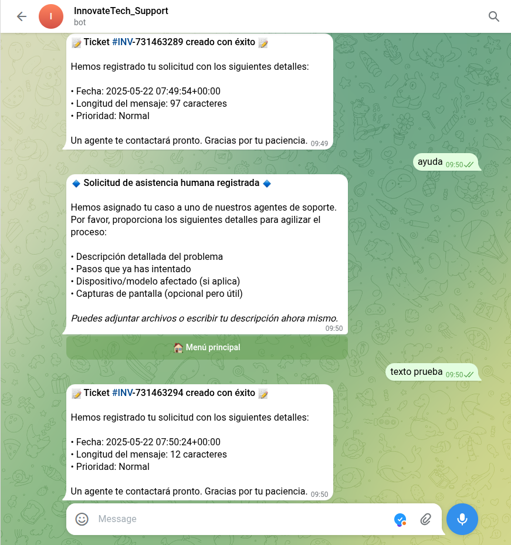

<a name="inicio"></a>


<h1 style="color: green; text-align: center; font-family: 'Montserrat', sans-serif; font-weight: bold;">THE CURE</h1>

# Servicios complementarios requeridos

Además de la implementación de los servicios básicos de AOD, VOD y base de datos, la empresa InnovateTech nos ha solicitado la implementación de cuatro servicios complementarios. 

**EXPLICAR MÁS SOBRE LAS RAZONES POR LAS QUE HEMOS ELEGIDO ESTOS SERVICIOS**

## Índice de Servicios Complementarios
 
1. [Servicio DNS](#servicio-dns)  
2. [Servicio de Web](#servicio-de-Web)  
3. [Servicio FTP](#Servicio-FTP)  
4. [Servicio de Chatbot para Soporte Técnico y Atención al Cliente](#Servicio-de-Chatbot-para-Soporte-Técnico-y-Atención-al-Cliente)  


---

# Servicio DNS


---


# Servicio de Web


---

# Servicio FTP

La implementación de un servidor FTP en un entorno cloud como AWS EC2 requiere una planificación meticulosa para garantizar no solo la transferencia eficiente de archivos multimedia, sino también su integración en un flujo de trabajo de retransmisión en vivo. ProFTPD se selecciona por su capacidad para manejar conexiones simultáneas y su flexibilidad en la configuración de permisos, esencial para entornos donde múltiples usuarios interactúan con contenido crítico. A continuación profundizaremos en cada etapa técnica, justificando decisiones de diseño y vinculándolas con los requisitos operativos de una plataforma de streaming.


## Configuración Inicial de la Instancia EC2

Antes de instalar cualquier servicio, es fundamental preparar el sistema operativo. En AWS, una instancia EC2 con Ubuntu Server 24.04 LTS ofrece un equilibrio entre estabilidad y acceso a paquetes actualizados. La actualización del sistema mediante **sudo apt update && sudo apt upgrade -y** no solo aplica parches de seguridad, sino que también asegura compatibilidad con bibliotecas críticas como OpenSSL, necesarias para protocolos cifrados como FTPS. Un reinicio posterior (**sudo reboot**) garantiza que los cambios en el kernel—esenciales para optimizar el rendimiento de red—se activen correctamente. Este paso previo mitiga riesgos como vulnerabilidades conocidas o incompatibilidades de software.

## Estructura de Directorios y Gestión de Usuarios

La creación de directorios bajo **/var/ftp/innovatetech** (pelis, series, musica, admin) organiza el contenido según su tipo, facilitando su gestión posterior. Asignar el usuario innovatetech_admin y el grupo innovatech como propietarios mediante **sudo chown -R innovatetech_admin:innovatech /var/ftp/innovatetech** establece una jerarquía clara: los administradores tienen control total, mientras que los usuarios regulares heredan permisos restringidos. El comando **sudo chmod g+s /var/ftp/innovatetech** asegura que los nuevos archivos creados en estos directorios hereden automáticamente el grupo innovatech, evitando errores de permisos en futuras subidas. Este enfoque es crucial en entornos colaborativos, donde múltiples administradores pueden necesitar acceder a los mismos recursos sin comprometer la seguridad.

## Configuración Detallada de ProFTPD

El archivo **/etc/proftpd/proftpd.conf** actúa como el núcleo de la configuración del servidor. La directiva MasqueradeAddress 34.233.187.138 (sustituyendo por la IP elástica de AWS) resuelve un problema común en entornos cloud: cuando el servidor FTP está detrás de un NAT, los clientes externos pueden recibir direcciones IP internas en las respuestas del modo pasivo, lo que interrumpe las transferencias. Al especificar la IP pública, se fuerza al servidor a anunciar la dirección correcta, asegurando que los puertos pasivos (49152-65534) sean accesibles externamente.
La sección **<Directory /var/ftp/innovatetech>** con **<Limit WRITE>** restringe operaciones de escritura al grupo innovatech, una medida de seguridad que previne modificaciones no autorizadas. Esto es particularmente relevante en plataformas de streaming, donde el contenido debe permanecer intacto hasta su procesamiento automatizado. La activación de FTPS mediante TLSEngine on y la vinculación de certificados SSL (TLSCertificateFile) protege las credenciales y los datos en tránsito, cumpliendo con estándares como PCI DSS para entornos que manejan información sensible.

## Integración con el Flujo de Retransmisión

A efecto teórico, el servidor FTP no opera en aislamiento. Los archivos subidos a **/var/ftp/innovatetech/pelis** suelen requerir procesamiento antes de su transmisión. Un script de Bash utilizando **FFmpeg (ffmpeg -i entrada.mp4 -c:v libx264 salida.m3u8)** convierte videos a formatos adaptativos como HLS, permitiendo streaming eficiente en diferentes calidades según el ancho de banda del usuario. Este script puede automatizarse con herramientas como inotifywait, que monitorea el directorio FTP y dispara conversiones ante nuevas subidas, creando un pipeline continuo desde la carga hasta la distribución.

La elección de NGINX con el módulo RTMP para el streaming final se debe a su eficiencia en la entrega de video en tiempo real. Configuraciones como allow publish 127.0.0.1 en NGINX restringen la publicación de streams al propio servidor, evitando que fuentes externas comprometan la integridad del sistema. Este flujo—FTP para ingestión, FFmpeg para procesamiento, NGINX para distribución—constituye una arquitectura escalable, capaz de manejar desde pequeñas emisoras hasta plataformas con miles de usuarios concurrentes.

## Estrategias de Mantenimiento y Resiliencia

La implementación de backups automatizados en AWS S3 mediante aws s3 sync protege contra pérdidas de datos por fallos hardware o corrupción de archivos. Programar esta tarea vía cron garantiza que los backups se ejecuten diariamente sin intervención manual. Paralelamente, herramientas como NetData ofrecen monitoreo en tiempo real de métricas clave: uso de CPU durante conversiones de video, ancho de banda consumido por FTP, o latencia en la entrega de streams. Esta visibilidad permite detectar cuellos de botella proactivamente, como un aumento inesperado en las transferencias FTP que podría indicar un ataque de fuerza bruta.

Las actualizaciones automáticas con unattended-upgrades son otra capa de defensa, parcheando vulnerabilidades críticas sin requerir supervisión constante. En entornos de alta disponibilidad, incluso un breve tiempo de inactividad puede impactar la experiencia del usuario, por lo que probar actualizaciones en un entorno de staging antes de aplicarlas en producción es una práctica recomendada.

## Solución de Problemas con Enfoque Pedagógico

Cuando un usuario reporta un error 550 Permission Denied al subir archivos, el proceso de diagnóstico debe ser metódico. Primero, verificar los permisos del directorio con **ls -ld /var/ftp/innovatetech/pelis:** si el grupo no es innovatech o los permisos no son 775, el servidor FTP denegará la escritura. Segundo, confirmar que el usuario pertenece al grupo mediante groups innovatetech_admin. Si el problema persiste, examinar los logs de ProFTPD **(/var/log/proftpd/proftpd.log)** puede revelar mensajes como "WRITE denied", indicando reglas de firewall mal configuradas o conflictos con SELinux/AppArmor.

Este enfoque no solo resuelve el incidente inmediato, sino que entrena al equipo en técnicas genéricas de diagnóstico—útil para futuros errores no documentados. Por ejemplo, un error 421 Service Not Available suele indicar que ProFTPD no está en ejecución, pero también podría deberse a puertos bloqueados o dependencias faltantes. La capacidad de diferenciar entre estas causas requiere comprender cómo interactúan los componentes del sistema, algo que una guía puramente procedimental no enseña.

## Conclusión y Consideraciones Futuras

La implementación descrita trasciende la mera instalación de un servidor FTP. Es un sistema integrado que abarca desde la seguridad perimetral (firewalls, FTPS) hasta la automatización de procesos (scripts de conversión, backups). Cada decisión técnica—desde la elección de puertos pasivos hasta la herencia de grupos con **chmod g+s—** está orientada a sostener una operación fluida y segura de la plataforma de streaming.
En futuras iteraciones, consideraciones como la migración a IPv6, la integración con autenticación LDAP/Active Directory, o la adopción de almacenamiento distribuido (como AWS EFS) podrían explorarse. Sin embargo, la base establecida aquí—documentación clara, seguridad por capas y automatización—proporciona una fundación sólida para escalar sin comprometer la estabilidad.


---
# Servicio de Chatbot para Soporte Técnico y Atención al Cliente

## Desarrollo e implementación de un bot de soporte automatizado mediante Telegram.

En un entorno profesional de servicios digitales como el de una empresa de streaming de audio y video, el área de soporte técnico desempeña un rol clave tanto para la continuidad operativa como para la experiencia del usuario final. Debido a la criticidad de los servicios ofrecidos —principalmente por su naturaleza 24/7, su dependencia del ancho de banda y su arquitectura distribuida—, es común encontrarse con un volumen importante de incidencias repetitivas, las cuales muchas veces pueden ser resueltas mediante respuestas automatizadas. En este contexto, la implementación de un bot de mensajería automatizado, utilizando Telegram como plataforma de mensajería y Python como lenguaje de programación, se convierte en una solución viable, escalable y segura para la gestión inicial de incidencias técnicas.

### Creación del bot en Telegram

El proceso comienza con la creación del bot en la plataforma de Telegram. Telegram proporciona una interfaz automatizada a través de un bot interno llamado **@BotFather**, el cual permite registrar nuevos bots mediante comandos. A través de este canal, el administrador puede definir el nombre del bot, su identificador único y, lo más importante, obtener el token de autenticación que servirá como clave privada para acceder a la API de Telegram. Este token es sensible, por lo tanto, se recomienda almacenarlo en un fichero externo .env o bien declararlo como variable de entorno en el sistema operativo, evitando así la exposición directa en el código fuente.

- Abre Telegram y busca el bot oficial @BotFather.
- Escribe el comando /newbot y sigue las instrucciones:

Ingresa un nombre visible para tu bot (por ejemplo: SoporteInnovateTechBot).

Ingresa un nombre de usuario único que termine en bot (por ejemplo: InnovateSupportBot).

- Una vez creado, @BotFather te enviará un token de autenticación, necesario para comunicarte con la API de Telegram.

⚠️ Importante: Guarda este token en un archivo .env o como variable de entorno del sistema para evitar su exposición en el código fuente.

### Entorno de desarrollo

Una vez obtenidas las credenciales, se procede con la preparación del entorno de desarrollo y ejecución. Para este proyecto se eligió el sistema operativo Ubuntu Server en su versión LTS más reciente, ya que proporciona un entorno estable, seguro y ampliamente utilizado en entornos de producción. El lenguaje de programación seleccionado fue Python, debido a su madurez, simplicidad y el amplio soporte de librerías tanto para operaciones de red como para el consumo de APIs REST. En concreto, se utilizó la librería **python-telegram-bot**, en su versión asíncrona (v20+), que permite aprovechar mejor los recursos del sistema y manejar múltiples usuarios concurrentemente sin bloquear procesos.

### Entorno virtual

Antes de escribir el código, se debe preparar un entorno virtual utilizando venv. Esto se hace con el objetivo de aislar las dependencias del bot respecto al sistema operativo base, evitando conflictos con otras aplicaciones o versiones de librerías. La activación del entorno virtual asegura que cualquier instalación de paquetes se realice en un directorio aislado. Dentro de este entorno se procede a instalar la librería principal del bot, junto con otras dependencias necesarias como aiohttp para posibles integraciones futuras con APIs externas.

**Instala Python y pip si aún no lo tienes**:

```bash
sudo apt update
 
sudo apt install python3 python3-pip python3-venv
```

**Crea un entorno virtual para aislar las dependencias del proyecto**:

```bash
python3 -m venv venv

source venv/bin/activate
```

**Instala las librerías necesarias**:

```bash
pip install python-telegram-bot aiohttp python-dotenv
```

### Código del bot

En cuanto al diseño lógico del bot, este se construye a través de una serie de funciones que representan distintos estados de conversación o flujos de decisión. Por ejemplo, al recibir el comando /start, el bot responde con un mensaje de bienvenida y presenta un menú de opciones utilizando botones interactivos. Cada botón está vinculado a una función específica que procesa la elección del usuario y lo guía por una rama distinta del árbol de decisiones. Estos flujos están pensados para cubrir las principales incidencias reportadas, como problemas de conexión, errores en la reproducción de video o mal funcionamiento del sistema. En cada paso, el bot evalúa la entrada del usuario y decide si puede proporcionar una solución directamente o si debe derivar la consulta a un técnico humano.

Una de las particularidades de este diseño es que toda la interfaz conversacional está desarrollada bajo principios UX, utilizando texto claro, iconografía mediante emojis para facilitar la interpretación, y formato enriquecido con Markdown. Además, el sistema está preparado para limitar el uso únicamente a usuarios previamente autorizados, lo que refuerza la seguridad del sistema y evita accesos no deseados.

[Contenido del Script del bot](https://docs.google.com/document/d/1ciAYTOS3JlcPLpn8Etczm83AJyZDRWpCtDJiNXGFcy8/edit?usp=sharing)

**Así es como queda el código de nuestro script en la instancia**:


### Configuración del bot como servicio

Para garantizar que el bot funcione de manera persistente y automática, incluso tras reinicios del sistema o caídas inesperadas, se configura como un servicio gestionado por systemd. Este proceso comienza con la redacción de un archivo de unidad que describe cómo debe ejecutarse el bot, qué usuario del sistema debe hacerlo, cuál es su directorio de trabajo, y qué acciones tomar en caso de errores. El uso de Restart=always en el fichero de configuración garantiza que cualquier fallo en el script desencadenará un reinicio automático del servicio tras unos segundos. Esta estrategia es fundamental para entornos CPD donde la disponibilidad es un requisito crítico.

La activación del servicio se realiza a través de los comandos de systemd, que permiten registrar el servicio en el arranque del sistema y verificar su estado en tiempo real. Además, los logs generados por el bot son capturados por journalctl, lo que facilita su monitorización, análisis y trazabilidad ante incidencias.


**Crea el archivo de servicio systemd**:

```bash
sudo nano /etc/systemd/system/telegrambot.service
```

**Contenido del archivo**:

```ini
[Unit]
Description=Bot de soporte Telegram
After=network.target

[Service]
User=ubuntu
WorkingDirectory=/home/ubuntu/soporte-bot
ExecStart=/home/ubuntu/soporte-bot/venv/bin/python3 /home/ubuntu/soporte-bot/bot.py
Restart=always

[Install]
WantedBy=multi-user.target
```

**Habilita y lanza el servicio**:

```bash
sudo systemctl daemon-reexec
sudo systemctl daemon-reload
sudo systemctl enable telegrambot
sudo systemctl start telegrambot
```

**Verifica el estado del bot**:

```bash
sudo systemctl status telegrambot
```


### Seguridad y administración

Desde el punto de vista de la seguridad y la administración de sistemas, se han adoptado una serie de prácticas recomendadas. En primer lugar, todo el tráfico entre el usuario y el bot está cifrado por el protocolo de Telegram, y el bot únicamente responde a comandos definidos, minimizando los vectores de ataque. En segundo lugar, se implementa un control de acceso básico basado en el identificador del usuario, bloqueando cualquier interacción de actores no autorizados. Por último, se contempla la posibilidad de añadir sistemas de alerta automáticos que envíen notificaciones al administrador cuando ocurren errores críticos, o incluso se podrían establecer integraciones con herramientas como Prometheus o Zabbix para enviar alertas en tiempo real sobre fallos en los sistemas del CPD.

### Posibles extensiones

Una vez implementado el sistema básico, el bot puede ser extendido fácilmente. Se puede conectar con una base de datos para registrar cada conversación y generar estadísticas, se puede diseñar una interfaz de administración para revisar los historiales, o incluso se puede desplegar en contenedores Docker para facilitar su portabilidad y escalabilidad. Otra mejora futura es el reemplazo del sistema de polling por el uso de webhooks, que permite al bot recibir actualizaciones en tiempo real mediante un servidor HTTPS, eliminando así la necesidad de consultas constantes a los servidores de Telegram, lo cual mejora el rendimiento y reduce el consumo de recursos.

## Funcionamiento





[**⬆️Subir**](#inicio)                                     [**Índice**](../../README.md){: .btn .btn-primary .float-right} 


---

[**⬆️ Volver al inicio**](#inicio)
