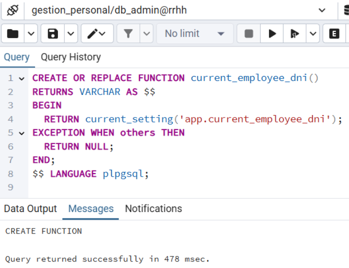
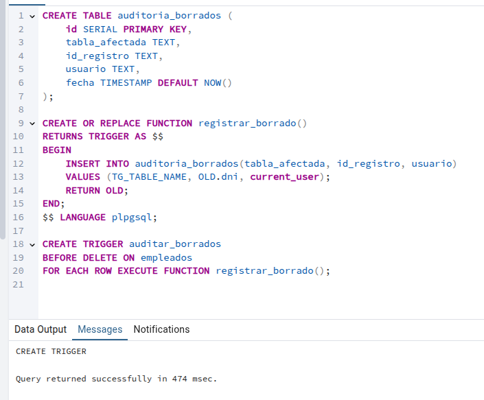
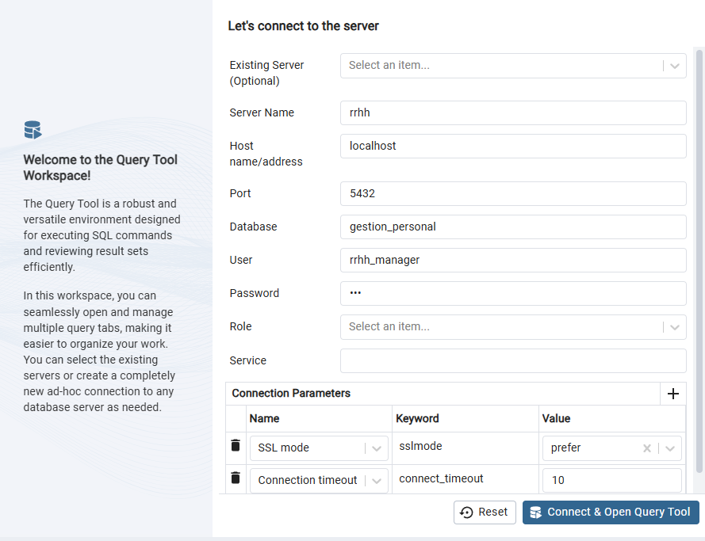

<h1 style="color: red; text-align: center; font-family: 'Montserrat', sans-serif; font-weight: bold; font-size: 64px;">THE CURE</h1>

# Diseño e implementación de la base de datos para InnovateTech

Hemos diseñado e implementado una base de datos completa para la gestión del personal, adaptada a los requisitos actuales del sector y conforme al convenio colectivo vigente en el ámbito de la consultoría, tecnologías de la información y estudios de mercado y opinión pública.

El sistema contempla los siguientes elementos clave:

<ul style="font-size: 1.25em; font-weight: bold;">
  <li>Gestión de empleados</li>
</ul>

Cada empleado queda registrado mediante su DNI o NIE. Además se registra su nombre, apellido, dirección, teléfono, puesto de trabajo, fecha de alta en el sistema de la empresa y su estado: si está activo o no.

<ul style="font-size: 1.25em; font-weight: bold;">
  <li>Estructura departamental</li>
</ul>

Los empleados están asignados a un departamento específico. Cada departamento se identifica mediante una id y contiene información detallada como el nombre completo y teléfono de contacto del departamento.

<ul style="font-size: 1.25em; font-weight: bold;">
  <li>Categoría</li>
</ul>

Cada empleado está asociado a un grupo_nivel dependiendo según el convenio al que pertenecen. Sin embargo, el grupo_nivel no identifica a los empleados en este caso, ya que contamos con empleados de otras áreas y eso haría que la identificación no fuera única violando así uno de los principios de integridad de los datos. La nomenclatura, que sí es un dato único en este caso, es el identificador que asocia a cada empleado con su salario, período de prueba, vacaciones y su grupo_nivel.

<ul style="font-size: 1.25em; font-weight: bold;">
  <li>Adaptación normativa</li>
</ul>

La base de datos ha sido desarrollada teniendo en cuenta que debe incluir al menos un empleado representativo de cada grupo_nivel contemplado en el área 2 del convenio sectorial. Toda la información salarial, de vacaciones y condiciones de prueba se ha introducido de acuerdo con las disposiciones de dicho convenio, actualizadas al año 2025.

Además del diseño conceptual y lógico (modelo entidad-relación y su transformación al modelo relacional), se ha realizado la implementación técnica de la base de datos en un sistema gestor de bases de datos PostgreSQL, incluyendo la carga de un volumen representativo de datos para permitir pruebas reales y análisis funcionales.

Esta solución permite una gestión eficaz, escalable y conforme a la normativa laboral vigente, ofreciendo una herramienta fiable para el control y seguimiento del personal de su empresa.

---

# Diseño conceptual

Después de haber entrevistado a los responsables de la empresa InnovateTech, hemos diseñado el siguiente modelo conceptual para su base de datos. 

## Entidades

Hemos identificado tres entidades clave para esta base de datos. Por un lado tenemos los empleados que representan a los trabajadores de la empresa. La empresa quiere identificarlos por su DNI por lo tanto, hemos considerado que DNI deberá ser el identificador, aunque hemos pensado que sería mejor llamarle id ya que haremos que al insertar datos dentro de este atributo siga el estándar de los DNI y los NIE.

Además del identificador hemos añadido los datos que son requeridos por la empresa y nosotros, bajo aprobación del responsable de la empresa, hemos considerado útil para el gestor de base de datos que se añadan los atributos fecha_alta y si el empleado está activo o no.

A su vez, estos empleados tienen asignada una categoría profesional de acuerdo al convenio que se les aplica en función del rol que desempeñan en esta empresa. Como la empresa quiere además añadir ciertos atributos a cada una de las categorías profesionales, esta se convierte en una entidad. Como ya hemos comentado anteriormente y bajo aprobación del responsable de la empresa, hemos declarado la nomenclatura definida en el convenio como identificador de cada una de las categorías que queremos guardar en la base de datos y hemos implementado el resto de datos que nos requiere la empresa, en este caso: grupo_nivel, salario, periodo_prueba y vacaciones. Los datos insertados en cada uno de estos atributos han sido minuciosamente identificados y verificados con los datos presentes en el convenio de 2025. 

Cabe destacar que nomenclatura es el dato que se ha declarado para relacionar la tabla que contiene los datos de las categorías con cada uno de los empleados que tiene la empresa, así cada empleado tendrá a su vez su propia nomenclatura, grupo_nivel, salario, periodo de prueba y vacaciones.

Por último, cada uno de los empleados tiene un solo departamento asignado y a su vez de cada uno de los departamentos necesitamos registrar valores como el nombre completo y el teléfono. Por ello, hemos convertido departamentos en una entidad con diferentes atributos. Para asociar cada departamento a su usuario, hemos insertado un id que será serial.

En resumen, necesitamos de las entidades departamento y categoría para conectar los valores departamento o teléfono de departamento y salario o vacaciones con la entidad empleados.

---

# Representación del diseño de la base de datos gestion_personal para InnovateTech

En la tabla empleados contaremos con una clave primaria que será id, esta identificará de manera equívoca a los empleados por su DNI o NIE. También contaremos con las siguientes claves foráneas siguiendo la regla de integridad referencial: 
Codigo_cat: esta es la clave foránea que conecta a cada uno de los empleados con valores como son el grupo_nivel, salario, periodo de prueba y las vacaciones. Codigo_cat es a su vez la clave primaria de la tabla categoría y en dicha tabla es denominada nomenclatura. Es una clave única e irrepetible según los datos encontrados en el convenio colectivo bajo el que se rigen los trabajos de los empleados de esta empresa en concreto. 
Id_dpt: esta es la clave foránea que relaciona a cada empleado con su departamento. Esta clave foránea es a su vez clave primaria en la entidad que contiene todos los datos requeridos de cada uno de los departamentos como son el nombre y el teléfono. Esta clave primaria en la entidad departamento es llamada id.

En cuanto al grado de relación aunque hay tres entidades, todas las relaciones son binarias (grado dos) porque cada relación conecta solo dos entidades a la vez y no hay una relación que involucre simultáneamente a las tres entidades (empleado, departamento, y categoría en una única relación de grado tres). 
Para que fuera grado de relación ternaria tendría que enfocarse de tal forma que para que un empleado esté en una categoría específica tiene que estar dentro de un departamento específico. Este no es el caso, tenemos empleados que pertenecen a departamentos diferentes pero están la misma categoría. 

La relación que encontramos entre empleado y departamento es de 1:N. Un empleado puede tener tan solo un departamento a la vez mientras que un departamento puede tener muchos empleados a la vez. 
La relación que existe entre empleados y categoría también es de 1:N. Un empleado puede pertenecer únicamente a una categoría mientras que una categoría puede albergar muchos empleados a la vez.

Como mínimo, la tabla empleados deberá contener estos datos: un empleado por cada uno de las categorías existentes en el área 2 del convenio de aplicación.

| id PK       | codigo_cat FK | id_dpt FK | nom       | apellidos           | direccion                                                  | telefono     | puesto                                                                                  |
|------------|--------------|----------|-----------|----------------------|-------------------------------------------------------------|--------------|-----------------------------------------------------------------------------------------|
| 12345678Z  | A2GAN1       | 8        | Marta     | Echevarría Gómez     | Calle Arriaga 15, 3ºA, 48001 Bilbao                         | 612 345 678  | Jefe/a de CAU, Coordinador/a de Atención Técnica                                       |
| 87654321X  | A2GBN1       | 4        | Iker      | López Ruiz           | Avenida Zabalbide 77, 1ºD, 48006 Bilbao                     | 633 987 654  | Técnico/a soporte nivel 2, Analista de incidencias                                     |
| 11223344L  | A2GBN2       | 4        | Leire     | González Arana       | Paseo Uribitarte 28, 2ºB, 48001 Bilbao                      | 655 432 198  | Técnico/a soporte nivel 1, Agente senior Helpdesk                                      |
| 99887766H  | A2GCN1       | 5        | Diego     | Romero Souto         | Calle do Franco 34, 2ºE, 15702 Santiago de Compostela       | 621 654 321  | Agente atención al usuario, Gestor/a de tickets                                        |
| 55667788P  | A2GCN2       | 4        | Paula     | Fernández Otero      | Rúa das Hortas 5, 1ºC, 15705 Santiago de Compostela         | 634 876 543  | Auxiliar de soporte, Operador/a de incidencias                                         |
| 33445566T  | A2GCN3       | 5        | Sergio    | Fernández Gil        | Plaza Mayor 3, 4ºD, 47001 Valladolid                        | 611 223 344  | Back office atención cliente, Auxiliar CAU                                             |
| 76543210M  | A2GDN1       | 5        | Manuel    | Castro Varela        | Avenida de Lugo 88, 4ºB, 15703 Santiago de Compostela       | 699 998 877  | Auxiliar administrativo Helpdesk, Atención presencial                                  |
| 44556677S  | A2GDN2       | 5        | Sara      | Jiménez Lorente      | Calle Alfonso I, 21, 2ºA, 50003 Zaragoza                    | 688 334 221  | Agente de recepción de solicitudes                                                      |
| 22334455K  | A2GDN3       | 5        | Javier    | Navarro Pardo        | Avenida Goya 66, 5ºD, 50005 Zaragoza                        | 677 123 789  | Telefonista, Registro de incidencias iniciales                                         |
| 66778899J  | A2GEN1       | 9        | Carmen    | Lafuente Gracia      | Calle del Coso 112, 3ºB, 50001 Zaragoza                     | 677 998 211  | Auxiliar de archivo o entrada de datos en CAU                                          |
| 611234567L | A2GEN2       | 5        | Alejandro | Serrano Biel         | Paseo Independencia 45, 6ºC, 50004 Zaragoza                 | 655 990 123  | Auxiliar junior en atención al cliente (sin experiencia)                               |

Como mínimo, la tabla categoria deberá contener estos datos.

| nomenclatura PK | grupo_nivel | salario     | periodo_prueba | vacaciones |
|--------------|-------------|-------------|----------------|------------|
| A2GAN1       | A1          | 22.246,16 €  | 6 meses        | 23 días    |
| A2GBN1       | B1          | 20.377,72 €  | 6 meses        | 23 días    |
| A2GBN2       | B2          | 18.485,91 €  | 6 meses        | 23 días    |
| A2GCN1       | C1          | 17.346,87 €  | 4 meses        | 23 días    |
| A2GCN2       | C2          | 17.056,00 €  | 4 meses        | 23 días    |
| A2GCN3       | C3          | 16.976,00 €  | 4 meses        | 23 días    |
| A2GDN1       | D1          | 16.896,00 €  | 3 meses        | 23 días    |
| A2GDN2       | D2          | 16.816,00 €  | 3 meses        | 23 días    |
| A2GDN3       | D3          | 16.736,00 €  | 3 meses        | 23 días    |
| A2GEN1       | E1          | 16.656,00 €  | 3 meses        | 23 días    |
| A2GEN2       | E2          | 16.576,00 €  | 3 meses        | 23 días    |

Como hemos contemplado que contarán con empleados pertenecientes a otras áreas, nuestra tabla contempla datos del área 6, 4 y 1.

---

Tabla departamento.

| id (SERIAL) PK | nom                         | telefono      |
|----------------|-----------------------------|---------------|
| 1              | Recursos Humanos            | 912345000     |
| 2              | Administración              | 912345001     |
| 3              | Finanzas                    | 912345002     |
| 4              | Soporte Técnico             | 912345003     |
| 5              | Atención al Cliente         | 912345004     |
| 6              | Markéting y Comunicación    | 912345005     |
| 7              | Dirección General           | 912345006     |
| 8              | Consultoría y Proyectos     | 912345007     |
| 9              | Estudios de mercado         | 912345008     |

Por razones de seguridad, las relaciones entre tablas han sido restringidas de modo que si se intenta hacer una actualización en las tablas categoría o departamento, esa actualización será replicada en la tabla de empleados. Sin embargo, si alguien borra uno de estos datos de una de estas tablas, la supresión será bloqueada y no se podrá llevar a cabo.

---

# Implementación de la base de datos en PostgreSQL: 

Como estamos en un entorno de producción, aunque este sea ficticio, creemos que no sería aceptable que nuestra base de datos estuviera dentro de la base de datos postgres. Por ello, hemos creado una base de datos específica para la gestión de personal, que es el caso que se nos ha proporcionado.

Hemos elegido PostgreSQL como sistema gestor de base de datos relacional y pgAdmin4 porque son el SGBD y la interfaz gráfica con la que solemos trabajar en nuestra empresa. La hemos implementado en multitud de proyectos exitosos y nos genera confianza.

Una vez tenemos instalado postgresql, accedemos a pgadmin4 desde cualquier navegador:

Una vez dentro, primero hemos creado un usuario que tendrá el rol de gestor de la base de datos: db_admin.

Después hemos creado nuestra base de datos que albergará nuestras tablas cuyo propietario será db_admin.

Nos conectamos a nuestro usuario gestor para poder seguir con la implementación de nuestra base de datos:

Ahora, con la base de datos creada, podremos crear las tablas que nos ha solicitado InnovateTech.

Creación de la tabla departamento:

Para evitar departamentos duplicados:

Inserción de datos:

Resultado tabla departamento:

Creación de la tabla categoria:

Inserción de datos:

Creación de la tabla empleados:

Inserción de datos:

Después hemos abierto la restricción de la clave primaria para que también podamos insertar NIE y cambiamos el nombre de la columna de DNI a id.

---

# Creación de los roles
Planteamiento de gestión de los usuarios que tendremos en nuestra base de datos. Contaremos con 4 tipos de roles en la base de datos.
En resumen estos serán los roles que tendrán los usuarios:

| Rol           | SELECT | INSERT | UPDATE | DELETE | CREATETABLE | DROPTABLE | ACCESO                          |
|---------------|--------|--------|--------|--------|-------------|-----------|----------------------------------|
| rol_admin     | Sí     | Sí     | Sí     | Sí     | Sí          | Sí        | Completo                        |
| rol_rrhh      | Sí     | Sí     | Sí     | No     | Sí          | No        | Todas las tablas de gestion_personal |
| rol_jefe      | Sí     | No     | No     | No     | No          | No        | Solo lectura                    |
| rol_empleado  | No     | No     | No     | No     | No          | No        | Solo sus datos                 |

---

* rol_admin

Usuario asignado: db_admin.

Será el gestor de la base de datos, este tendrá todos los permisos necesarios para la gestión de la base de datos. Será el superadmin, podrá crear tablas, eliminarlas, seleccionar información y actualizarla.

Ejemplo de creación de rol en pgAdmin4:

---

* rol_rrhh

Usuario asignado: rrhh_manager.

Será un empleado de recursos humanos que podrá ver, añadir y actualizar todas las tablas de esta base de datos y crear nuevas tablas. No obstante, no podrá borrar tablas. 

---

* rol_jefe

  
Usuario asignado: jefe1.

Este rol corresponde al rol de jefe o manager. Está dedicado a cualquiera de los usuarios de mi base de datos que gestiona o tenga empleados que supervisar.
Los usuarios de este rol tan solo podrán visualizar información. Para cualquier actualización en la base de datos deberán dirigirse a cualquiera de los encargados de la base de datos dentro del departamento de recursos humanos.

---

* rol_empleado

  
Usuario asignado: 87654321X

Es el rol dedicado a cada uno de los empleados de la empresa. Estos usarán su DNI o NIE para entrar en la base de datos y hemos implementado una solución para que solo puedan ver sus datos personales: creación de vistas específicas.

Creamos una función para identificar a los usuarios conectados por su id.

Los empleados solo tendrán permisos para visualizar sus propios datos. No tendrán acceso a ninguna tabla a menos que la visualicen con la vista que hemos creado.

Resumen de los permisos concedidos con los roles: 
Vemos que el rol de empleado no tiene ningún permiso, excepto el de la vista que le hemos creado específicamente y asignado.

El resto de usuarios han sido creados después de haber configurado el rol al que pertenecen. La asignación del rol ha sido realizada de la misma forma que para los usuarios que son empleados.

Vídeo explicativo del rol de empleados:

<iframe src="https://drive.google.com/file/d/1XGmWKYgdAX6pj_-XGMiOeveZoVBEm7jS/preview" 
        width="640" height="360" allow="autoplay" allowfullscreen></iframe>

---

## Control de supresión en la base de datos

De manera complementaria, también hemos creado una tabla suplementaria y un trigger, este trigger registrará en la tabla cada vez que un usuario haga una supresión. Debido a que tan solo el rol de administrador tiene permisos drop table y borrado de estructuras en las tablas, este sería el único rol que se vería afectado por este trigger. 

---
# Conclusión

La implementación de la base de datos para InnovateTech ha sido diseñada siguiendo estrictos criterios de seguridad, integridad y escalabilidad, garantizando así una solución robusta y preparada para el crecimiento futuro de la organización.

Desde el diseño conceptual hasta la implementación técnica en PostgreSQL, se han respetado rigurosamente las reglas de integridad referencial, evitando duplicidades, asegurando la unicidad de los identificadores y definiendo relaciones claras y coherentes entre entidades. Cada decisión en el modelado de datos ha sido tomada en base a requerimientos reales y validada con fuentes oficiales, como el convenio colectivo sectorial actualizado al año 2025.

En términos de seguridad, se ha establecido un sistema de roles y permisos bien estructurado, asegurando que cada usuario acceda solo a la información pertinente a su perfil. El uso de vistas personalizadas, funciones de control de acceso y triggers de auditoría refuerza aún más la protección de los datos.

Además, el modelo relacional y su estructura modular permiten que esta base de datos sea escalable, facilitando la incorporación de nuevas funcionalidades, departamentos o categorías sin comprometer la integridad de los datos ni la estabilidad del sistema.

En resumen, se ha desarrollado una solución tecnológica confiable, segura y alineada con la normativa laboral, que no solo satisface las necesidades actuales de InnovateTech, sino que también sienta las bases para su evolución a largo plazo.

---

# Recursos Audiovisuales sobre la Configuración de la Base de Datos

Acceso, tablas y usuarios.

<iframe src="https://drive.google.com/file/d/1HbVQ5my2Zxo8uzYx94tpk0rPwYEEan_5/preview" 
        width="640" height="360" allow="autoplay" allowfullscreen></iframe>

Demostración permisos rol_jefe y rol_rrhh

<iframe src="https://drive.google.com/file/d/1J45s7AZ03q5fLB1bc7D_-H7WlTLfsuZP/preview" 
        width="640" height="360" allow="autoplay" allowfullscreen></iframe>

<iframe src="https://drive.google.com/file/d/1S2jB9aiV6MdV3T6Itr93ufhF0UmcN9LC/preview" 
        width="640" height="360" allow="autoplay" allowfullscreen></iframe>

---

Hemos habilitado este usuario para conexión y verificación del funcionamiento de la base de datos.

En el navegador, busque esta dirección: http://23.21.221.213:5050/browser/

**Usuario**: victor.pastor@itb.cat

**Contraseña**: @ITB2024

A continuación, necesitarán conectarse al servidor introduciendo estos datos:

---

[**⬆️Subir**](#inicio)                                     [**Índice**](../../README.md){: .btn .btn-primary .float-right} 
