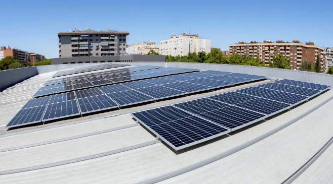
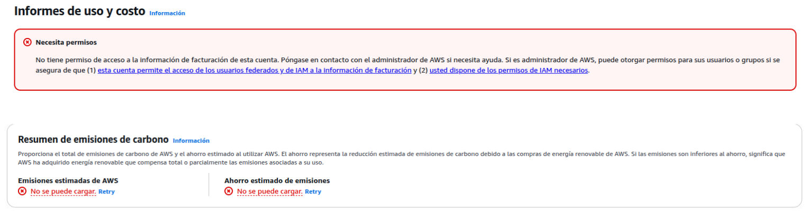
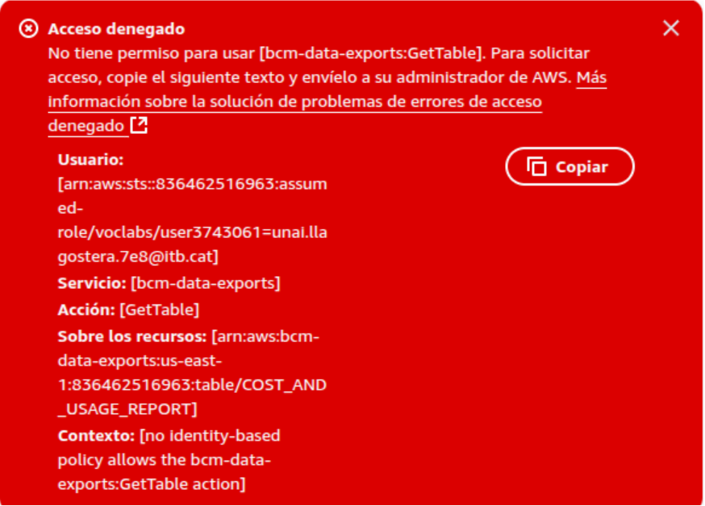

<h1 style="color: red; text-align: center; font-family: 'Montserrat', sans-serif; font-weight: bold; font-size: 64px;">THE CURE</h1>

# Sostenibilidad y eficiencia energética

---

La sostenibilidad es un pilar estratégico del proyecto de InnovateTech, que busca minimizar el impacto ambiental de sus infraestructuras TIC, integrando Centros de Procesamiento de Datos (CPD) físicos en Zaragoza, Bilbao y Santiago de Compostela. Este enfoque combina eficiencia energética, uso de energías renovables, gestión responsable de residuos y gobernanza digital robusta, asegurando un desarrollo responsable y resiliente. El diseño cumple con normativas clave como el Reglamento General de Protección de Datos (RGPD), el Esquema Nacional de Seguridad (ENS), la Directiva (UE) 2023/1791 sobre eficiencia energética y la Directiva 2012/19/UE sobre residuos de aparatos eléctricos y electrónicos (RAEE). A través de medidas técnicas, operativas y estratégicas, la compañía se posiciona como líder en sostenibilidad digital, optimizando recursos y reduciendo la huella ecológica sin comprometer el rendimiento.

La infraestructura híbrida combina CPDs físicos optimizados con servicios en la nube de AWS, priorizando la región eu-west-3 (París) por su alta proporción de energía renovable, lo que reduce las emisiones asociadas al procesamiento y almacenamiento. Zaragoza actúa como nodo principal, con 36 servidores blade (Intel Xeon, 512 GB RAM, SSD/NVMe) para streaming y tareas on demand. Bilbao, con 16 servidores blade, ofrece redundancia activa, mientras que Santiago, con 2 servidores en modo pasivo, se enfoca en almacenamiento frío. Los CPDs utilizan almacenamiento NAS TrueNAS con RAID Z2/Z1, discos SAS de 14 TB y caché SSD, junto con sistemas de climatización avanzados (InRow Cooling, sensores IoT, Schneider EcoStruxure). En AWS, se implementan instancias EC2 t2.large (2 vCPUs, 8 GB RAM) para streaming (GStreamer, Icecast2), almacenamiento de logs, backups en Glacier, funciones Lambda para automatización, y AWS Direct Connect para conexiones de baja latencia. El sistema soporta hasta 1 millón de usuarios concurrentes, con un tráfico estimado de 4-8 Mbps por usuario (4-8 Tbps en horas punta con el tope de usuarios recurrentes) y un ancho de banda mensual de 2 PB, con sesiones de 12-15 minutos.

La estimación de la huella energética considera los recursos TIC y el consumo energético. Los recursos incluyen 150 vCPUs, 400 GB de RAM, 250 TB de almacenamiento y 2 PB de ancho de banda mensual. Hemos estimado mediante calculadoras energéticas artificiales, un consumo de 5,800 kWh/mes (69,600 kWh/año), equivalente a 1,352 toneladas de CO₂/año (0.233 kg CO₂ eq/kWh). El tráfico de streaming, con 2 PB/mes (24 PB/año), consume 10,000 kWh/mes (120,000 kWh/año) a 5 W/GB, generando 2.33 toneladas de CO₂/año. En los CPDs, utilizando los datos del primer texto, Zaragoza consume 75,000 kWh/año (PUE 1.4), Bilbao 68,000 kWh/año (PUE 1.45), y Santiago 30,000 kWh/año (PUE 1.2), sumando 173,000 kWh/año. Con un factor de emisión de 0.25 kg CO₂/kWh (España 2023) y asumiendo un 30% de energía no renovable, los CPDs generan 12,975 kg CO₂/año. La huella total del proyecto es de aproximadamente 14,657 kg CO₂/año (14.66 toneladas), significativamente menor que estimaciones iniciales debido a la optimización energética.

| **Recurso TIC**                 | **Cantidad estimada**                                |
|--------------------------------|------------------------------------------------------|
| **CPU (cloud + físico)**       | ~150 vCPUs (media en autoscaling)                   |
| **RAM**                        | ~400 GB en total                                    |
| **Almacenamiento**             | 250 TB (contenido multimedia + backups)             |
| **Ancho de banda mensual**     | ~2 PB (streaming AOD/VOD a 0.8-2.5 Mbps)            |
| **Usuarios concurrentes**      | Entre 500,000 y 1,000,000 al día                    |
| **Tiempo medio de uso/usuario**| 12-15 minutos/día para consumo multimedia           |

Para optimizar la eficiencia energética, se implementan tecnologías serverless (AWS Lambda), autoescalado inteligente de EC2, y almacenamiento frío en Glacier. En los CPDs, se automatiza el apagado de servidores no críticos con Wake-on-LAN y scripts programados, y se establecen políticas de carga horaria para evitar picos en la red eléctrica. En AWS, se detienen entornos de desarrollo fuera del horario laboral y se limpian recursos residuales con AWS Systems Manager y Lambda. El streaming VOD/AOD se optimiza ajustando bitrate y compresión, reduciendo el consumo por byte transferido. Se evalúa el uso futuro de instancias Graviton2 (C6g) y CloudFront para disminuir el tráfico directo al CPD hasta un 30%. Estas medidas, basadas en el principio de “eficiencia por diseño”, utilizan virtualización, contenedores y escalado dinámico para adaptar recursos a la demanda real.

La monitorización ambiental y energética garantiza un control preciso. En Zaragoza y Bilbao, sensores IoT miden temperatura, humedad y presión diferencial en pasillos frío/caliente, regulando la climatización con controladores adaptativos. Prometheus y Grafana, integrados con SNMP, visualizan tendencias de consumo y alertas de sobreconsumo en tiempo real. Se considera implementar EcoStruxure de Schneider Electric o OpenDCIM para una gestión granular a nivel de rack. AWS CloudWatch y Customer Carbon Footprint Tool proporcionan métricas de emisiones en la nube, complementando la monitorización local. La climatización avanzada incluye free cooling y evaluación de liquid cooling para racks de alta densidad, mejorando el PUE.

## Estimación de consumo energético y huella de carbono

La energía renovable es un componente clave. En Zaragoza, se instala un sistema fotovoltaico de 50 kWp en 400 m², generando 65,000 kWh/año (35% del consumo del CPD), con una reducción de 15.1 toneladas de CO₂/año. Se planea escalar a 100 kWp (130,000 kWh/año) y ampliar a 30 kWp en Bilbao. Santiago utiliza energía renovable certificada (70-80%) para su operación pasiva. Los excedentes solares se autoconsumen o vierten a la red, alineándose con la Directiva (UE) 2023/1791. La región eu-west-3 de AWS, con alta proporción de renovables, minimiza las emisiones en la nube. Se adquieren Garantías de Origen y se evalúa participar en proyectos de reforestación como Amazon Climate Pledge.

La economía circular y la gestión de residuos refuerzan la sostenibilidad. Se reutilizan switches, cables y racks en entornos de pruebas o formación, y se reciclan baterías y componentes RAEE con gestores certificados, cumpliendo la Directiva 2012/19/UE y la Ley 7/2022. Los equipos obsoletos se donan a centros educativos o se desmontan para reciclaje responsable. Estas prácticas minimizan el desperdicio y promueven un modelo circular.
El PUE refleja la eficiencia energética: 1.4 en Zaragoza (pasillos frío/caliente, climatización adaptativa), 1.45 en Bilbao (diseño redundante), y 1.2-1.3 en Santiago (operación pasiva). El objetivo es reducir el PUE medio global por debajo de 1.35 en cinco años, con mejoras como free cooling y automatización climática. 

| **CPD**         | **Consumo Anual (kWh)** | **PUE** | **Emisiones (kg CO₂)** |
|----------------|--------------------------|--------|-------------------------|
| Zaragoza       | 75,000                   | 1.4    | 5,625                   |
| Bilbao         | 68,000                   | 1.45   | 5,100                   |
| Santiago       | 30,000                   | 1.2    | 2,250                   |
| **Total CPDs** | **173,000**              | **1.35** | **12,975**              |

Los compromisos voluntarios incluyen reducir el consumo energético directo de los CPD un 25% para 2030 (respecto a 2024), alcanzar un 40% de energía renovable en Zaragoza en cinco años, y minimizar emisiones por tráfico de datos con regiones cloud sostenibles y compresión multimedia. Se implementa una política de compra verde, priorizando proveedores con compromisos climáticos certificados. La gobernanza TIC asegura el cumplimiento de RGPD y ENS, con métricas como DCeP y CUE para medir el progreso. El impacto esperado incluye una reducción de emisiones de hasta 40% (5,862 kg CO₂/año), un PUE de 1.1-1.2, y un ahorro de 600,000-700,000 kWh/año, consolidando a InnovateTech como líder en sostenibilidad digital.

| **Fuente**              | **Consumo (kWh/año)** | **Emisiones (kg CO₂/año)** |
|-------------------------|-----------------------|-----------------------------|
| CPDs físicos            | 173,000               | 12,975                      |
| AWS (EC2 + servicios)   | 69,600                | 1,352                       |
| Tráfico de red          | 120,000               | 2,330                       |
| **Total anual**         | **362,600**           | **14,657**                  |

En conclusión, el proyecto realizado para InnovateTech establece un modelo de sostenibilidad digital escalable y adaptable, integrando eficiencia energética, energías renovables, economía circular y gobernanza digital en una infraestructura híbrida que equilibra alto rendimiento y responsabilidad ambiental. La reducción de horas de funcionamiento se logra mediante la automatización de apagado de servidores no críticos en los CPD y entornos cloud fuera del horario laboral, optimizando el consumo energético. El uso de servicios con energía renovable se prioriza con la selección de la región eu-west-3 de AWS, que opera con un alto porcentaje de fuentes renovables, y la instalación de paneles solares de 50 kWp en Zaragoza, escalables a 100 kWp, que generan hasta 130,000 kWh/año. La elección de regiones de nube más eficientes, como París, minimiza la huella de carbono del procesamiento y almacenamiento, complementada por monitorización avanzada con Prometheus, Grafana, CloudWatch y EcoStruxure. Estas medidas, junto con compromisos ambiciosos de reducir el 25% del consumo energético para 2030 y alcanzar un 40% de energía renovable en cinco años, aseguran el cumplimiento de normativas como RGPD, ENS y la Directiva (UE) 2023/1791, posicionando a InnovateTech como líder en innovación responsable frente a las demandas ambientales del contexto europeo.

---

## Breve consideración 

### Limitaciones en el uso de herramientas oficiales y enfoque alternativo

Durante el desarrollo del proyecto, se debía implementar el uso de la herramienta oficial **AWS Customer Carbon Footprint Tool** para calcular con precisión las emisiones asociadas al uso de los servicios cloud. Sin embargo, debido a que el entorno de trabajo se ha desarrollado a través de una cuenta de estudiante proporcionada por **AWS Educate**, esta no dispone de permisos para acceder a dicha funcionalidad, reservada únicamente para cuentas empresariales o con soporte habilitado.

Ante esta limitación, se optó por emplear una estrategia alternativa basada en modelos estimativos generados mediante IA, utilizando datos técnicos, documentación oficial y literatura científica relevante. Pues, consideramos que para este proyecto también es importante la digitalización aplicada en los sectores productivos que se refiere a la identificación de aplicaciones de la IA en entornos del sector donde está enmarcado describiendo las mejoras implícitas en su implementación. Asimismo, las fuentes y supuestos utilizados incluyen:

- **Factores de emisión** del *Ministerio para la Transición Ecológica y el Reto Demográfico (MITECO)* de España (0.25 kg CO₂/kWh como valor medio en 2023).
- Datos de consumo energético típicos por componente TIC extraídos de:
  - *Greenhouse Gas Protocol ICT Sector Guidance*
  - *Uptime Institute* y *ASHRAE TC 9.9*
  - *The Green Grid* (para estimaciones de PUE y eficiencia energética)
- Parámetros técnicos publicados por **AWS** sobre consumo energético y eficiencia de instancias EC2, uso de redes, y almacenamiento (como Glacier).
- Estimaciones de consumo energético del tráfico de datos basadas en publicaciones académicas y técnicas como:
  - *"The Energy and Carbon Impact of the Internet and Cloud Services"* (Andrae & Edler, 2015)
  - *IEA – International Energy Agency reports on data centers and streaming*
- Factores de eficiencia y consumo de streaming multimedia calculados a partir de promedios establecidos en informes de **Carbon Trust** y **IEA**, considerando **5 Wh/GB** como media para transmisión de datos.

Gracias a esta combinación de fuentes se ha podido realizar una estimación razonable de la **huella de carbono total del sistema híbrido** (CPDs físicos y nube), asegurando transparencia y coherencia metodológica, pese a no contar con acceso a las herramientas automatizadas de AWS.

---

[**⬆️Subir**](#inicio)                                     [**Índice**](../../README.md){: .btn .btn-primary .float-right}
