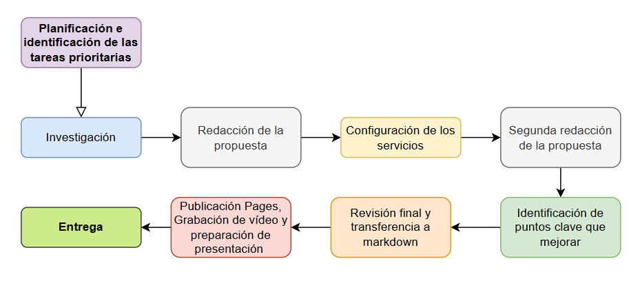

<h1 style="color: red; text-align: center; font-family: 'Montserrat', sans-serif; font-weight: bold; font-size: 64px;">THE CURE</h1>

---

# Progreso de investigación y asignación de tareas

---

El desarrollo del proyecto para la infraestructura del CPD de InnovateTech ha seguido un proceso estructurado y colaborativo, que ha permitido definir con precisión las necesidades y las soluciones técnicas adecuadas.

### Algunas de las etapas del proceso

#### Análisis inicial de la empresa y su mercado
Se definió el perfil de la empresa InnovateTech como una plataforma multimedia híbrida con más de 3 millones de usuarios y capaz de ofrecer sus servicios a entre 500.000 y 1 millón de usuarios concurrentes, enfocada exclusivamente en Europa. Esto marcó el punto de partida para dimensionar la infraestructura necesaria en términos de capacidad y rendimiento.

#### Dimensionamiento y diseño preliminar
Se realizó un dimensionamiento inicial basado en casos reales de empresas similares (como YouTube, Spotify) pero ajustado a nuestra escala, incluyendo la cantidad de usuarios concurrentes, tipos de servicios (AOD, VOD, Web y chatbot entre otros), y la infraestructura necesaria en racks, servidores, almacenamiento y redes.

#### Elección de arquitectura y niveles de redundancia
Después de analizar distintas opciones (CPD Tier 2 vs Tier 3), se optó por una arquitectura Tier 2 con un enfoque híbrido, combinando CPDs propios para la infraestructura crítica y servicios en la nube (AWS), buscando un equilibrio óptimo entre coste, seguridad y eficiencia energética.

#### Detallado técnico de la infraestructura física
Se definieron aspectos clave como la ubicación física del CPD, sistemas de climatización y refrigeración con free cooling, distribución y gestión del cableado, seguridad física y lógica, y el diseño de los racks con componentes específicos (servidores, switches, patch panels).

#### Sostenibilidad y eficiencia energética
Se incorporaron criterios claros para garantizar la eficiencia energética del CPD, el uso de energías renovables, optimización del consumo y reducción de la huella ambiental, alineándose con los Objetivos de Desarrollo Sostenible (ODS).

### Asignación de Tareas

El equipo de trabajo, compuesto por 4 personas, se organizó de manera flexible, permitiendo que cada miembro asumiera tareas en función de sus intereses, habilidades y preferencias.

Para asegurar un avance fluido y eficiente del proyecto, la asignación de responsabilidades se gestionó a través de **Trello**, donde cada tarea fue etiquetada y asignada con fechas límite y con el seguimiento correspondiente. Como la distribución de las tareas era flexible, hemos seccionado estas tareas iniciales en tareas más pequeñas, haciendo que todo el equipo trabaje en todos los cuatro bloques de tareas mencionados anteriormente. Algunas de las tareas iniciales incluyeron:

- **Definición de la magnitud de la empresa InnovateTech**: Nos hemos puesto de acuerdo en la cantidad de usuarios recurrentes y los registrados, además de medir si era factible el número de CPDs para todos los usuarios concurrentes.
- **Búsqueda de información**: Con este paso, hemos empezado a extraer toda la información necesaria para ir avanzando en la creación de nuestra propuesta de CPD.
- **Diseño de la arquitectura física del CPD**: Definición de la ubicación, distribución de la sala, sistemas de climatización, seguridad física y cableado.
- **Confección de planos**.
- **Configuración y gestión de infraestructura IT**: Selección y configuración de servidores, almacenamiento, redes y seguridad lógica.

Cuando ya teníamos una base firme de nuestra propuesta, llegamos a una fase de bloqueo en la búsqueda de información en la que no conseguíamos avanzar, así que, decidimos pasar a la acción con la implementación de los servicios en AWS.
Para ello creamos las instancias necesarias y abrimos los puertos requeridos por cada uno de los servicios en los grupos de seguridad creados acorde a cada instancia y su servicio dentro de AWS.

## Distribución de las tareas

- **Carolina**: empezó con la búsqueda de información de la parte de seguridad lógica y al quedar bloqueada pasó a la confección de la base de datos. Una vez terminada esta tarea, volvió a la propuesta para verificar y revisar la coherencia de la información que habíamos añadido e identificar la falta o redundancia de información y por último se encargó de la confección del markdown. 

- **Unai**: investigó sobre la geotermia y la posible implementación en los tres CPDs. Una vez realizada esta tarea, pasó a la confección y diseño de los planos y definición de las medidas de prevención a aplicar. Configuró el servicio de chatbot y ftp. Por último, participó en la revisión final y confección de la propuesta.

- **Richard**: investigó sobre seguridad lógica, backups, cableado estructurado, comparativa de proveedores cloud, la seguridad física junto con Unai y la selección de servidores junto con Eric también. Una vez realizadas estas tareas, pasó a la implementación de los servicios de audio y video, así como las comprobaciones del ancho de banda. Por último, estableció estos servicios junto con Eric en el servidor Web.

- **Erick**: se encargó de la selección de servidor, la seguridad física, ubicación física de la nave industrial, la parte de sostenibilidad de la propuesta y el diseño de los racks en packet tracer. Cuando terminó estas tareas se dedicó a la implementación del servidor DNS y servidor Web Nginx que alberga los servicios de AOD y VOD.

### Configuración del Tablero

---

Creamos un tablero específico para el proyecto, con listas organizadas en función de las fases del proyecto, tales como:

- **Por hacer (To Do)**: Tareas que aún deben iniciarse.
- **Backlog / Ideas iniciales**: para aquellas ideas de implementación que se nos van ocurriendo, preguntas para los profesores/cliente en este caso o recordatorios de ideas que comentar en equipo.
- **En Progreso**: tareas que están en ejecución.
- **En revisión**: tareas que han sido completadas y están a la espera de revisión o pruebas.
- **Completado**: tareas que ya han sido finalizadas y validadas.
- **Bloqueado**: para aquellas tareas con las que nos hemos quedado atascados y necesitamos ayuda grupal para seguir. 

### Control de Avances y Notificaciones

---

El uso de **checklists** dentro de las tarjetas de Trello nos permitió dividir las tareas más complejas en subtareas más pequeñas y manejables. Además, las notificaciones automáticas y los comentarios en cada tarea nos ayudaron a mantener una comunicación constante entre todos nosotros.

### Revisión y actualización continua
---

El equipo se reunió semanalmente para revisar el progreso de las tareas, realizar ajustes necesarios y actualizar el tablero de Trello. Esto asegura que todas las partes del proyecto sigan su curso según lo planificado y nos permitió tomar decisiones rápidas cuando surgió algún imprevisto ya que en algún momento todos quedamos bloqueados. 

Algunas de las dificultades que enfrentamos fue el diseño de la seguridad lógica de la propuesta, la implementación de los servicios de elasticsearch y kibana para monitorización, backup de la base de datos automatizada y configuración del servicio de servidor Web ya que queríamos que fuera posible que se pudiera servir audio y vídeo a la vez dependiendo de lo que el cliente solicitaba a través de la página web. Por último, encontramos algunas limitaciones en el entorno facilitado para albergar los servicios, AWS, ya que no pudimos usar la AWS Carbon Footprint Tool, ni otros servicios que nos hubiera gustado aprender a desarrollar como AWS IAM, AWS RDS y Cloudwatch para la monitorización. 

El hecho de que quedaramos bloqueados en algunas tareas ha provocado que fuera más fácil para nosotros que la asignación se realizara cada día dependiendo del avance de cada una de las tareas y no al principio del proyecto. Esta flexibilidad y pivoteo entre tareas y temas ha hecho que todos estemos al tanto de cada una de las partes del proyecto así como el buen funcionamiento y colaboración del equipo.

## Diagrama de Flujo e imágenes del progreso en Trello

A continuación, las diferentes fases por las que ha pasado nuestro Trello a lo largo de todo el proyecto. Encontramos las fases de planificación, desarrollo, integración, revisión y entrega.

<iframe src="https://drive.google.com/file/d/1O9b2LqE0mrIfZOgROyvMJMpKk-3EdtnR/preview" 
        width="640" height="360" allow="autoplay" allowfullscreen></iframe>

> Ilustración de las fases del proyecto en Trello

  

> Diagrama de flujo

---

[**⬆️Subir**](#inicio)                                     [**Índice**](../../README.md){: .btn .btn-primary .float-right} 

